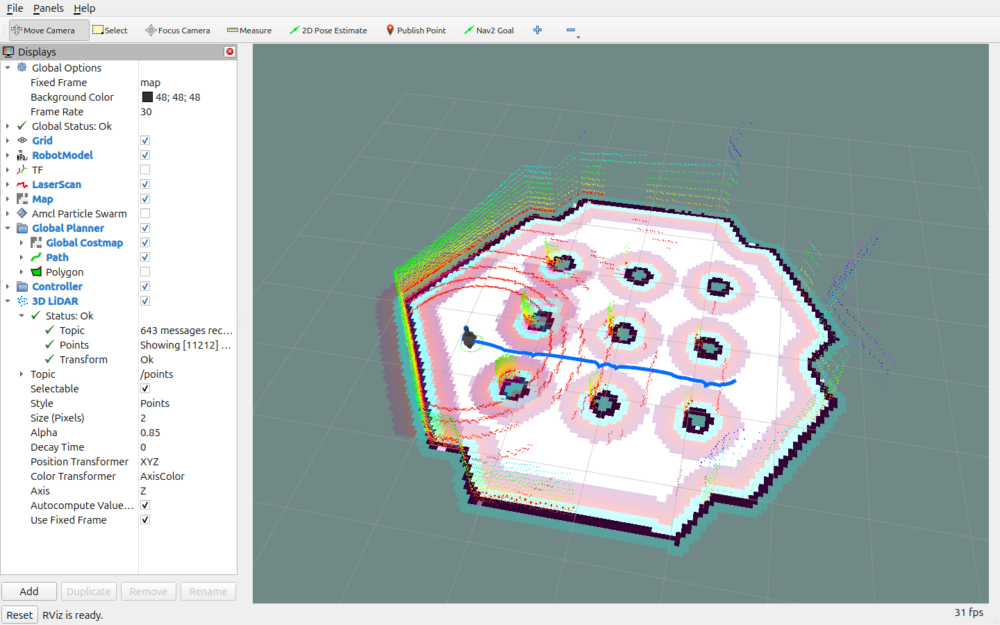

# 2주차 인지팀 — Burger의 Nav2 목표 주행

TurtleBot3 Burger에 Nav2 목표를 보내고, 진행 상황과 최종 결과를 확인하는 개인 제출용 코드입니다. [과제 안내](../../week2-slam/turtlebot-nav2-task.md)의 지도·위치·경로·이동 명령을 실제 주행에서 관찰할 수 있도록 구성했습니다.

## 실행 환경과 제공 자료

- Ubuntu 24.04, ROS 2 Jazzy, Nav2 1.3.13, Gazebo Harmonic 8.x.
- TurtleBot3 Burger + 기본 2D LDS + 16채널 3D LiDAR + IMU.
- 지도·로봇·센서·브리지는 [공통 준비 환경](../../week2-slam/preparation/README.md)을 재사용합니다. 준비 환경 기준 커밋은 `1d853de`입니다.
- Nav2는 `/scan`과 `/odom`을 사용합니다. `/points`와 `/imu`는 함께 발행하고 준비 상태를 확인하지만, 3D costmap이나 IMU EKF 융합을 구성한 것은 아닙니다.

이 폴더는 **저장소 전체를 clone한 상태**에서 실행합니다. 공통 준비 폴더가 필요하며 ROS 패키지를 별도로 빌드할 필요는 없습니다. Python venv/Conda를 비활성화하고 ROS apt 패키지와 시스템 Python을 사용합니다.

## 작성·변경한 파일

```text
Week2/wanjun/
├── navigate_to_goal.py           # Nav2 action 클라이언트와 결과 기록
├── config/goal.yaml              # 기본 목표 좌표와 제한 시간
├── config/nav2_overrides.yaml    # 개인 Nav2 변경값
├── config/recording.rviz         # 지도·경로·3D 점군을 함께 보는 촬영 시점
├── launch/submission.launch.py   # 기본 설정에 변경값을 병합하고 시뮬레이션 시작
├── scripts/run_simulation.sh
├── scripts/run_goal.sh
├── media/                       # 실제 주행 영상·RViz 캡처·해당 실행 결과
└── README.md
```

개인 코드는 공통 Burger 모델을 다시 구현하지 않고 `NavigateToPose` action을 호출합니다. 공통 설정은 원본을 수정하지 않고 읽은 뒤, 개인 변경값을 병합한 임시 YAML을 만들어 사용합니다. 잘못 입력한 설정 키는 launch에서 오류로 알려 줍니다. 임시 설정은 종료할 때 삭제됩니다.

| 변경 항목 | 공통 기본값 | 개인 설정 | 목적 |
| --- | --- | --- | --- |
| MPPI 전진·후진 상한 | ±0.22 m/s | ±0.18 m/s | 이동을 관찰하기 쉬운 속도 |
| velocity smoother 전진·후진 상한 | ±0.22 m/s | ±0.18 m/s | 제어기와 최종 명령의 속도 제한 일치 |
| 위치 도착 허용 오차 | 0.25 m | 0.15 m | 목표 위치 도착 판정을 더 엄격하게 설정 |
| 방향 도착 허용 오차 | 0.25 rad | 0.15 rad | 목표 방향 도착 판정을 더 엄격하게 설정 |

로봇 반지름·센서 설정·가속도 등 나머지 값은 공통 Burger 설정을 사용합니다. 속도를 낮추면 주행 시간이 길어질 수 있고, 허용 오차를 줄이면 목표 부근에서 자세 조정이 더 필요할 수 있습니다.

## 설치

ROS 2 Jazzy 설치 후 저장소 루트에서 실행합니다.

```bash
./week2-slam/preparation/scripts/install_dependencies.sh
./week2-slam/preparation/scripts/check_environment.sh
```

의존성 설치와 센서 사양은 [준비 환경 README](../../week2-slam/preparation/README.md), [센서 안내](../../week2-slam/preparation/docs/sensors.md)를 참고합니다.

## 실행

터미널 1에서 개인 설정을 적용한 시뮬레이션을 시작합니다.

```bash
# AI-study 저장소 루트에서
./Week2/wanjun/scripts/run_simulation.sh
```

Gazebo와 RViz가 열리고 시작 위치 `(-2.0, -0.5, yaw=0)`가 적용됩니다. 이 실행과 공통 `run_simulation.sh`를 동시에 켜지 않습니다. 시뮬레이션만 실행하면 목표는 전송되지 않습니다.

터미널 2에서 기본 목표를 전송합니다.

```bash
./Week2/wanjun/scripts/run_goal.sh
```

기본 목표는 **`map` 좌표의 `(x=1.5 m, y=-0.5 m, yaw=0 rad)`**입니다. 제공 지도에서 사용할 예제 좌표이며 운영자가 별도로 지정한 목표는 아닙니다. `config/goal.yaml`을 수정하거나 명령행으로 좌표를 바꿀 수 있습니다.

```bash
# 명령행 값은 해당 goal.yaml 값보다 우선합니다.
./Week2/wanjun/scripts/run_goal.sh --x 1.5 --y -0.5 --yaw 0.0

# 주행 제한 시간을 변경
./Week2/wanjun/scripts/run_goal.sh --timeout 120

# 별도 목표 YAML 사용
./Week2/wanjun/scripts/run_goal.sh --goal-file /절대/경로/goal.yaml
```

스크립트는 실행 위치와 무관하게 자신의 파일 경로를 기준으로 설정을 찾습니다. 두 실행 스크립트 모두 공통 `env.sh`를 사용하므로 기본 `ROS_DOMAIN_ID=42`가 일치합니다. 다른 도메인을 지정한다면 모든 터미널에 같은 값을 사용하세요.

GUI를 줄여 검증하려면 다음처럼 실행합니다. GPU 센서 렌더링 환경은 여전히 필요합니다.

```bash
./Week2/wanjun/scripts/run_simulation.sh headless:=True
./Week2/wanjun/scripts/run_simulation.sh --show-args
```

## 코드의 실행 순서

1. 목표 YAML과 명령행 값을 읽고 숫자·시간 제한을 검사합니다. NaN·무한대·0 이하 제한 시간은 거부합니다.
2. 증가하는 `/clock`, `/map`, 최신 `/scan`·`/points`·`/imu`·`/odom`, `map → base_link` TF, Nav2 Active 상태와 action 서버를 기다립니다.
3. 목표가 지도 내부의 알려진 자유 셀인지 확인합니다. 이 검사는 목표 중심점 검사이며 로봇 크기와 경로의 실제 통과 가능성은 Nav2가 판단합니다.
4. `NavigateToPose`로 목표를 전송하고 약 1초마다 남은 거리와 복구 횟수를 출력합니다.
5. Nav2가 반환한 성공·실패·취소 상태를 기록합니다. 종료 시 TF로 얻은 위치·방향 오차도 별도로 계산합니다.

초기 위치는 공통 launch에서 적용합니다. 목표 스크립트가 실행될 때마다 로봇의 위치 추정을 강제로 시작점으로 되돌리지 않습니다. 같은 시뮬레이션에서 다음 목표를 실행하면 현재 위치에서 출발합니다. 같은 조건으로 재시험하려면 시뮬레이션을 종료하고 다시 실행합니다.

## 결과와 중단

실행 결과 JSON은 `Week2/wanjun/artifacts/run_날짜시각.json`에 생성됩니다. 목표, 시작·종료 위치, 위치·방향 오차, 소요 시간, 센서 수신 개수, 최대 선속도 명령, Nav2 피드백을 기록합니다. 기존 파일을 덮어쓰지 않습니다. 결과 파일은 자동 커밋하지 않도록 `.gitignore`에 등록했습니다.

```bash
./Week2/wanjun/scripts/run_goal.sh --output /tmp/my-nav2-run.json
```

| 종료 코드 | 의미 |
| --- | --- |
| `0` | Nav2가 `SUCCEEDED` 반환 |
| `1` | 목표 거절, Nav2 주행 실패 또는 외부 취소 |
| `2` | 입력·지도·실행 오류 |
| `124` | 시작 준비 또는 주행 제한 시간 초과 |
| `130` | `Ctrl+C`로 중단 |
| `143` | 종료 신호 `SIGTERM`으로 중단 |

시작 준비 기본 제한은 60초, 주행 기본 제한은 180초이며 **실제 경과 시간 기준**입니다. 응답 확인과 취소 완료를 기다리는 시간이 추가될 수 있습니다. `Ctrl+C`나 주행 시간 초과 시 이 스크립트가 보낸 목표만 취소하며, `terminal_state_after_cancel`에 확인한 최종 상태를 남깁니다. 서버가 응답하지 않아 `UNKNOWN`이면 취소 완료를 확인하지 못한 상태이므로 Nav2 상태를 확인하고 필요하면 시뮬레이션을 종료합니다.

목표를 실행하는 동안 RViz에서 다른 목표를 동시에 보내면 기존 목표가 교체될 수 있습니다. 시뮬레이션 종료는 터미널 1에서 `Ctrl+C`로 수행합니다.

## RViz에서 확인할 것

- `Map`: 주행할 공간의 지도.
- `RobotModel`, `LaserScan`: 추정된 로봇 위치와 센서·지도 정합.
- `Global Planner → Path`: 목표까지 계획한 전역 경로.
- `Controller`: 주변 costmap과 지역 경로.
- `3D LiDAR`: `/points`의 높이별 점군.

지도는 고정된 장애물 정보를 제공하고, AMCL과 TF는 그 지도에서의 로봇 위치를 연결합니다. NavFn이 경로를 계획하면 MPPI가 이를 추종할 속도를 계산합니다. velocity smoother와 collision monitor를 거친 `/cmd_vel`이 Gazebo 로봇을 움직입니다. RViz는 이 데이터들을 보여 주는 도구입니다.

## 실행 검증

작성한 코드를 실제 Jazzy/Gazebo 환경에서 검증한 결과를 아래에 기록합니다.

2026-09-26, Ubuntu 24.04 / ROS 2 Jazzy / Nav2 1.3.13 / Gazebo Sim 8.15.0에서 확인했습니다.

| 검증 | 결과 |
| --- | --- |
| 기본 목표 `(-2.0, -0.5) → (1.5, -0.5)` | `SUCCEEDED`, 실제 경과 시간 22.735초 |
| 최종 TF 기준 위치·방향 오차 | 약 0.151 m / 0.035 rad |
| 관찰한 최대 선속도 명령 | 0.18 m/s |
| `/plan`, `/cmd_vel`, `/scan`, `/points`, `/imu` 수신 | 확인 |
| 지도 밖 목표·NaN 좌표 | 목표 실행 전 거부 |
| 시뮬레이션 미실행 시 준비 대기 | 제한 시간 후 종료 |
| 주행 제한 시간 초과 / `Ctrl+C` | 해당 목표 취소 및 `CANCELED` 확인 |

위 숫자는 한 번의 실제 검증 결과이며 성능 보장값은 아닙니다. 성공 여부는 Nav2 action 결과로 판정합니다. 오차는 결과 수신 후 읽은 TF로 계산하므로 제어기가 도착 판정을 내린 순간의 값과 조금 다를 수 있습니다.

## 주행 영상과 RViz 캡처

2026-09-26에 개인 설정을 적용한 Burger를 시작점에서 다시 실행하고 촬영했습니다. **목표 전송 전부터 `SUCCEEDED` 확인 후까지 이어지는 실제 RViz 화면**이며, 재생 속도는 1배입니다. 화면 위 자막에는 실행할 명령, 목표 좌표, 실제 action 피드백과 최종 결과를 표시했습니다.

- [자율주행 영상 — MP4](media/nav2-navigation.mp4)
- [RViz 원본 캡처 — PNG](media/rviz-map-path.png)
- [이 촬영의 실행 결과 — JSON](media/navigation-run.json)

영상은 30.28초, 1440×1008, 25 fps의 H.264 MP4(약 8.3 MB)입니다. 이 촬영의 실행 결과는 `SUCCEEDED`, 준비 대기를 포함한 실제 경과 시간 21.676초, 최종 위치 오차 약 0.147 m, 최대 선속도 명령 0.18 m/s였습니다.

[](media/nav2-navigation.mp4)

카메라는 바닥을 약 49도 내려다보는 Orbit 시점입니다. 파란 선은 `/plan` 전역 경로이며, 벽과 기둥 주변의 무지개색 점군은 `/points`를 높이(Z)에 따라 표시한 3D LiDAR 데이터입니다. PNG는 같은 주행 중에 캡처한 RViz 원본 화면입니다. 영상 초반 일부 프레임에서 점군의 `Transform` 상태가 `Error`로 표시된 뒤 `Ok`로 돌아오는 모습도 그대로 포함했습니다. 주행 중 캡처와 도착 장면에서는 정상 상태를 확인했습니다.

촬영 시점과 같은 구도로 실행하려면 저장소 루트에서 다음 순서로 실행합니다.

```bash
# 터미널 1: 시뮬레이션과 Nav2
./Week2/wanjun/scripts/run_simulation.sh headless:=True use_rviz:=False

# 터미널 2: 촬영용 RViz 보기
source ./week2-slam/preparation/scripts/env.sh
rviz2 -d ./Week2/wanjun/config/recording.rviz --ros-args -p use_sim_time:=true

# 터미널 3: 목표 전송
./Week2/wanjun/scripts/run_goal.sh
```

MP4와 PNG는 제출을 위해 선별한 결과물로 커밋했습니다. 일반 실행에서 생성하는 `artifacts/` 결과는 계속 제외합니다.

## Notion·PR 제출 시 남은 항목

- 개인 Notion 학습 페이지: 아직 기재하지 않았습니다. 시도한 설정, 관찰 결과, 문제 해결 과정을 본인이 정리하고 링크를 추가합니다.
- PR: 직접 생성하고 운영자를 Reviewer로 지정하며 본문에 멘션합니다.

## 참고 자료

- [ROS 2 Jazzy Action Client 예제](https://docs.ros.org/en/jazzy/p/action_tutorials_py/__README.html): 비동기 목표·피드백·결과 처리.
- [Nav2 Jazzy Navigation Servers](https://docs.nav2.org/jazzy/getting_started/navigation_concepts/navigation_servers/): 목표 action과 계획·제어 서버의 역할.
- [공통 Nav2·TF·RViz 교보재](../../week2-slam/preparation/docs/concepts.md).
