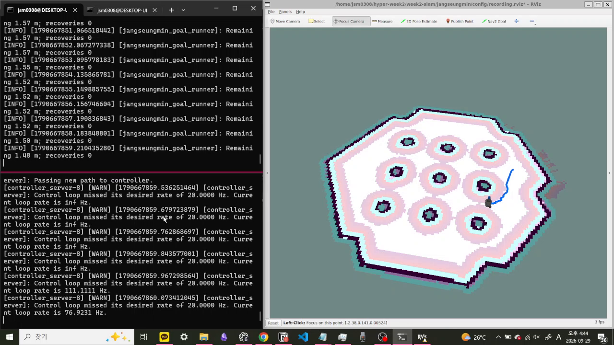

# 2주차 인지팀 — TurtleBot3 Nav2 자율주행 수행 과정

TurtleBot3 Burger를 Gazebo Sim에서 실행하고, 저장된 지도와 AMCL을 이용해 현재 위치를 추정한 뒤 Nav2로 지정 목표까지 자율주행한다. 개인 목표는 `map` 좌표계의 `(1.8, 0.6, 0.0)`이며, 실행 결과는 JSON으로 남긴다.

## 제출 결과

- 자율주행 영상: [media/nav2-navigation.mp4](media/nav2-navigation.mp4)
- RViz 지도·계획 경로 캡처: [media/rviz-map-path.png](media/rviz-map-path.png)
- 영상 촬영 실행 결과: [media/navigation-run.json](media/navigation-run.json)
- 전체 성공·실패 이력: [RUN_HISTORY.md](RUN_HISTORY.md)

영상과 캡처는 제출용 Nav2 설정을 적용한 뒤, 목표 전송부터 도착 결과까지 기록한 것이다. 세부 실행 수치는 아래 검증 결과에 적었다.

[](media/nav2-navigation.mp4)

위 이미지를 누르면 목표 전송부터 `SUCCEEDED` 판정까지 담은 영상을 확인할 수 있다.

## 실행 환경

| 항목 | 구성 |
| --- | --- |
| OS | Ubuntu 24.04 LTS on WSL2 |
| ROS 2 | Jazzy Jalisco |
| Nav2 | 1.3.13 |
| Gazebo | Harmonic 8.15.0 |
| RViz | 14.1.23 |
| 로봇 | TurtleBot3 Burger |
| 센서 | 2D LiDAR, 16채널 3D LiDAR, IMU |

세부 버전과 센서·토픽·TF 구성은 [ROBOT_SPEC.md](ROBOT_SPEC.md)에 정리했다.

## 폴더 구성

```text
week2-slam/jangseungmin/
├── README.md                      # 제출 개요와 실행 방법
├── navigate_to_goal.py            # NavigateToPose 목표 전송·결과 기록
├── launch/
│   ├── simulation.launch.py       # Gazebo, 센서, Nav2, RViz 실행
│   └── submission.launch.py       # 개인 Nav2 설정과 촬영용 RViz 적용
├── config/
│   ├── nav2_params.yaml           # Nav2 전체 기본 설정
│   ├── nav2_overrides.yaml        # 개인 변경값
│   ├── goal.yaml                  # 기본 목표 좌표
│   ├── bridge.yaml                # Gazebo–ROS 토픽 브리지
│   └── recording.rviz             # 제출 영상·스크린샷용 화면
├── models/burger_sensors.urdf.xacro
├── maps/tb3_sandbox.{yaml,pgm}
├── scripts/                       # 설치·점검·실행 스크립트
├── media/                         # 영상, 스크린샷, 실행 결과
├── docs/                          # 개념·센서·문제 해결 안내
└── SETUP.md / ROBOT_SPEC.md / THIRD_PARTY.md
```

## 수행 과정과 설정 변경

처음에는 제공된 시뮬레이션을 실행하고 기본 목표 `(1.5, -0.5, 0.0)`를 전송해 전체 구성이 작동하는지 확인했다. 이후 개인 목표를 `(1.8, 0.6, 0.0)`으로 바꾸고 주행 과정을 촬영했다. 이 과정에서 발생한 오류를 실행 기록과 로그로 확인한 뒤 설정을 하나씩 조정했다.

### 1. 실행 순서를 바로잡았다

첫 시도에서는 시뮬레이션이 준비되기 전에 목표를 전송해 startup timeout이 발생했다. 이후 지도, 센서, TF, Nav2가 모두 준비되고 RViz에 `Navigation: active`, `Localization: active`가 표시된 다음 목표를 전송했다. `navigate_to_goal.py`에도 같은 준비 상태를 확인하는 절차를 넣어 잘못된 실행 순서를 바로 알 수 있게 했다.

### 2. 촬영 부하를 줄였다

Gazebo, RViz, 3D LiDAR와 화면 수집을 동시에 실행하자 주행 처리가 지연되고 목표가 중단됐다. 촬영용 `recording.rviz`에서는 3D LiDAR를 기본적으로 끄고 화면 표시 속도를 20 fps로 낮췄다. 최종 촬영에서는 Gazebo GUI도 숨겨 지도, 로봇, 전역 경로와 Nav2 상태를 확인하는 데 필요한 화면만 남겼다. 센서와 물리 시뮬레이션은 계속 실행된다.

### 3. 경로 계산 요청이 너무 빨리 중단되는 문제를 수정했다

개인 목표를 전송한 A05와 A06에서는 `compute_path_to_pose` 액션이 목표 승인 응답을 기다리다가 중단됐다. 당시 `default_server_timeout`은 `20 ms`였고, WSL2에서 RViz와 녹화를 함께 실행할 때 생기는 지연을 버티지 못했다. 이 값을 `2000 ms`로 늘린 뒤에는 목표가 승인되고 로봇이 실제 경로를 따라 움직였다.

### 4. 주행 제한 시간을 실제 실행 속도에 맞췄다

서버 대기 시간을 수정한 뒤에는 로봇이 정상적으로 이동했지만, A07에서 180초 제한에 먼저 걸렸다. 남은 거리가 `4.92 m`에서 `2.05 m`까지 줄고 있었으므로 경로 계산 실패가 아니라 전체 제한 시간 문제로 판단했다. 제한을 `420 s`로 늘린 A08은 198.475초 후 `SUCCEEDED`로 끝났다.

### 5. 주행을 관찰하고 도착을 확인할 기준을 정했다

최대 선속도는 `0.22 m/s`에서 `0.18 m/s`로 낮췄다. RViz에서 로봇과 경로를 따라가기 쉬워지는 대신 전체 주행 시간은 길어진다. MPPI controller와 velocity smoother의 상한을 함께 바꿔 두 단계의 속도 제한이 어긋나지 않도록 했다.

위치와 방향의 도착 허용 오차는 각각 `0.25`에서 `0.15`로 줄였다. 목표 근처까지 이동한 화면만으로 성공이라고 판단하지 않고, 더 좁은 범위에 들어와 Nav2가 `SUCCEEDED`를 반환했을 때만 도착으로 판정하기 위한 설정이다. 최종 실행의 위치 오차는 `0.140 m`, yaw 오차는 `0.150 rad`였다.

기준 설정은 `config/nav2_params.yaml`에 남기고, 직접 조정한 값은 `config/nav2_overrides.yaml`에 분리했다. `submission.launch.py`가 실행할 때 두 파일을 병합하므로 변경값을 확인하기 쉽고, 문제가 생기면 `run_base_simulation.sh`로 기준 설정과 비교할 수 있다. 전체 A01~A08 기록은 [RUN_HISTORY.md](RUN_HISTORY.md)에 정리했다.

3D LiDAR와 IMU 토픽은 발행·수신 여부를 점검하지만 현재 Nav2 costmap이나 위치 추정에는 융합하지 않는다. 주행에는 2D `/scan`과 `/odom`을 사용한다.

## 설치

ROS 2 Jazzy 설치 후 저장소 루트에서 실행한다.

```bash
cd week2-slam/jangseungmin
bash scripts/install_dependencies.sh
bash scripts/check_environment.sh
```

정상 환경에서는 Nav2, TurtleBot3, `ros_gz`, RViz, TF 패키지와 센서·지도 항목이 모두 `OK`로 표시된다. 자세한 최초 설치 과정은 [SETUP.md](SETUP.md)를 참고한다.

## 실행

터미널 1에서 개인 설정과 제출용 RViz 화면을 실행한다.

```bash
cd week2-slam/jangseungmin
bash scripts/run_simulation.sh headless:=True
```

`headless:=True`는 Gazebo 그래픽 창만 숨긴다. 물리 시뮬레이션과 센서, Nav2, RViz는 계속 실행되므로 내장 그래픽 환경에서 촬영할 때 사용했다. Gazebo 화면도 함께 보려면 인자를 빼고 실행한다.

Nav2 패널에서 `Navigation: active`, `Localization: active`가 표시되고 지도와 로봇이 나타날 때까지 기다린다.

터미널 2에서 목표를 전송한다.

```bash
cd week2-slam/jangseungmin
bash scripts/run_goal.sh
```

다른 목표는 명령행에서 지정할 수 있다.

```bash
bash scripts/run_goal.sh \
  --x 1.8 \
  --y 0.6 \
  --yaw 0.0 \
  --timeout 420 \
  --output media/navigation-run.json
```

성공하면 터미널에 `SUCCEEDED`가 출력되고 지정한 `media/navigation-run.json`에 결과가 생성된다. 시뮬레이션을 종료할 때는 터미널 1에서 `Ctrl+C`를 누른다.

## 실행 흐름

1. Gazebo가 월드와 TurtleBot의 물리 움직임, LiDAR·IMU·odometry를 생성한다.
2. ROS–Gazebo 브리지가 `/scan`, `/points`, `/imu`, `/odom`, `/cmd_vel` 등을 연결한다.
3. AMCL이 저장된 지도, 2D LiDAR와 odometry를 이용해 `map → odom` 변환을 추정한다.
4. NavFn이 `/plan` 전역 경로를 만들고, MPPI controller가 경로를 따라갈 속도 명령을 계산한다.
5. `/cmd_vel`이 Gazebo의 차동 구동 로봇에 전달된다.
6. RViz에서 지도, 로봇 위치, 계획 경로, costmap과 도착 상태를 확인한다.

## 과제 요소 설명

- 지도(`/map`): 벽과 이동 가능한 공간을 나타내는 고정 점유 지도다.
- 로봇 위치: AMCL이 지도, 2D LiDAR, odometry를 비교해 추정한다.
- 계획 경로(`/plan`): 전역 계획기 NavFn이 현재 위치에서 목표까지 계산한 경로다.
- 이동 명령(`/cmd_vel`): MPPI controller의 출력을 속도 평활화와 충돌 검사를 거쳐 로봇에 전달한 선속도·각속도다.
- Costmap: 장애물과 장애물 주변의 이동 비용을 격자로 표현한다. Nav2는 로봇 반지름과 inflation 영역을 고려해 벽에서 거리를 둔다.

## 검증 결과

아래 수치는 최종 성공 JSON에서 확인했다. 이 실행은 이전 timeout 시도가 정지한 위치에서 새 목표를 전송했기 때문에 초기 생성 좌표가 아닌 JSON의 `start_pose`를 시작점으로 기록했다.

| 검증 항목 | 결과 |
| --- | --- |
| 주행 결과 | `(0.815, -0.550) → (1.8, 0.6)`, `SUCCEEDED`, 198.475초, recovery 0회 |
| 최종 위치·방향 오차 | 위치 `0.140 m`, yaw `0.150 rad` |
| 최대 선속도 명령 | `0.18 m/s` |
| 토픽 수신 | `/plan` 168, `/cmd_vel` 681, `/scan` 100, `/points` 200, `/imu` 3683 messages |
| 제출 영상 | 1280×720, 30 fps, 214.07초 |

## 참고 문서

- [설치·기본 실행 안내](SETUP.md)
- [로봇·센서·TF·Nav2 사양](ROBOT_SPEC.md)
- [Nav2·TF·RViz 개념](docs/concepts.md)
- [센서 점검](docs/sensors.md)
- [문제 해결](docs/troubleshooting.md)
- [자산 출처와 라이선스](THIRD_PARTY.md)

실행 환경의 기본 구성은 공통 실습 폴더인 [`week2-slam/wanjun`](../wanjun)을 기준으로 했다. 이 제출물에서는 개인 목표, 오류 대응 설정, 촬영 화면, 실행 기록과 최종 결과를 별도로 구성했다.
