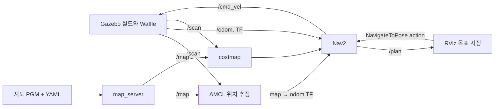
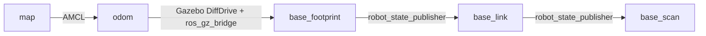

# Nav2·TF·RViz 준비 교보재

이 문서는 공통 시작 환경을 이해하기 위한 자료입니다. 개인 설정 변경에 대한 설명이나 과제 수행 결과는 각자 실습하면서 정리합니다.

## 1. 데이터가 흐르는 순서



| 요소 | 하는 일 | 이 환경에서 확인하는 곳 |
| --- | --- | --- |
| 지도 | 고정된 공간의 점유 상태를 격자로 표현 | `maps/tb3_sandbox.pgm`, `/map` |
| 로봇 위치 | 지도 위에서 현재 위치와 방향을 추정 | AMCL, `/amcl_pose`, TF |
| costmap | 지도·센서 장애물과 로봇 크기를 고려해 주행 비용을 표현 | `/global_costmap/costmap`, `/local_costmap/costmap` |
| 계획 경로 | 현재 위치에서 목표까지 지나갈 위치의 순서 | NavFn, `/plan` |
| 이동 명령 | 경로를 따라가기 위한 선속도·각속도 | MPPI 및 후처리 노드, `/cmd_vel` |
| RViz | ROS 데이터와 좌표계를 표시하고 목표·초기 위치를 입력 | `rviz/practice.rviz` |
| Gazebo | 로봇 운동과 센서 데이터를 시뮬레이션 | Waffle 모델과 sandbox 월드 |

이 시작 환경은 저장된 지도에서 **AMCL로 위치를 추정**합니다. 새 지도를 만드는 SLAM 단계는 실행하지 않습니다. Nav2는 경로 계획과 추종을 관리하고, RViz는 상태를 보여 줍니다. RViz에 경로가 보이는 것과 시뮬레이터에서 로봇이 실제로 움직이는 것은 각각 확인해야 합니다.

## 2. Nav2에서 먼저 볼 구성 요소

`bt_navigator`는 목표 action을 받아 Behavior Tree에 따라 계획·추종·복구 동작을 연결합니다. `planner_server`의 NavFn은 전역 경로를 만들고, `controller_server`의 MPPI는 주변 장애물과 경로를 바탕으로 속도를 계산합니다. 이 설정의 MPPI 운동 모델은 차동 구동인 `DiffDrive`입니다.

기본 실행에서는 controller의 명령이 velocity smoother와 collision monitor를 거쳐 최종 `/cmd_vel`로 전달됩니다. Gazebo 브리지가 이 `geometry_msgs/msg/Twist`를 로봇의 차동 구동 시스템에 넘깁니다. 센서가 멈추거나 TF가 없으면 경로가 있어도 이동 명령이 유효하게 전달되지 않을 수 있습니다.

`config/nav2_params.yaml`에서 먼저 읽을 항목은 다음과 같습니다. 주행 파라미터는 공식 기본 설정을 유지합니다. AMCL의 `set_initial_pose: true`와 `initial_pose: {x: -2.0, y: -0.5, z: 0.0, yaw: 0.0}`은 고정 생성 위치에 맞춘 공통 준비값입니다.

| 경로 | 기본값 | 의미 |
| --- | --- | --- |
| `amcl.ros__parameters.scan_topic` | `scan` | 위치 추정에 사용할 LiDAR |
| `planner_server.ros__parameters.GridBased.plugin` | `nav2_navfn_planner::NavfnPlanner` | 전역 경로 계획기 |
| `controller_server.ros__parameters.FollowPath.plugin` | `nav2_mppi_controller::MPPIController` | 경로 추종 제어기 |
| `controller_server.ros__parameters.FollowPath.vx_max` | `0.5` m/s | 제어기의 전진 속도 상한 |
| `controller_server.ros__parameters.general_goal_checker.xy_goal_tolerance` | `0.25` m | 위치 도착 허용 오차 |
| 같은 goal checker의 `yaw_goal_tolerance` | `0.25` rad | 방향 도착 허용 오차 |
| 두 costmap의 `robot_radius` | `0.22` m | 기본 원형 충돌 모델 |
| 두 costmap의 `inflation_layer.inflation_radius` | `0.7` m | 장애물 주변에 비용을 부여하는 범위 |

속도나 로봇 크기를 바꾸면 controller뿐 아니라 velocity smoother, costmap, collision monitor의 관련 설정도 함께 살펴봐야 합니다. `use_sim_time=True`와 지도 경로는 launch에서 전달하므로 YAML에 값이 없어도 실행 시 적용됩니다.

## 3. TF: 다른 좌표계의 데이터를 연결하기



위 그림은 이 Waffle 모델의 주행·LiDAR에 필요한 가지입니다. 실제 트리에는 바퀴, IMU, 카메라 등의 프레임도 있습니다.

- `map`: 지도에 고정된 전역 기준입니다. AMCL이 오차를 보정하면 지도 기준 추정 위치가 달라질 수 있습니다.
- `odom`: 연속적인 이동을 표현하는 기준입니다. 실제 로봇의 주행거리계는 시간이 지나면 오차가 누적될 수 있습니다.
- `base_footprint`: 로봇 바닥면 기준입니다. 이 모델에서는 Gazebo의 주행거리계가 이 프레임까지 변환을 발행합니다.
- `base_link`: 로봇 몸체 기준입니다.
- `base_scan`: LiDAR 센서 기준입니다. `/scan`의 `header.frame_id`와 연결되어야 합니다.

지도와 센서 데이터를 겹치려면 해당 시각의 변환을 찾을 수 있어야 합니다. `map → odom`은 AMCL의 동적 추정값이므로 임의의 static transform으로 메우지 않습니다. 센서와 TF의 시간 기준도 `/clock`으로 맞아야 합니다.

별도 터미널에서 준비 폴더로 이동하고 환경을 설정한 뒤 조회합니다.

```bash
source scripts/env.sh
ros2 run tf2_ros tf2_echo odom base_footprint
# Ctrl+C 후 다음 조회
ros2 run tf2_ros tf2_echo base_link base_scan
# AMCL 초기 위치 적용 이후 조회
ros2 run tf2_ros tf2_echo map base_link
```

TF 전체 그림이 필요하면 아래 명령을 사용할 수 있습니다. PDF 등 진단 파일은 `/tmp`에 생성합니다.

```bash
source scripts/env.sh
cd /tmp
ros2 run tf2_tools view_frames --ros-args -p use_sim_time:=true
```

## 4. RViz에서 읽을 화면

| 항목 | 연결 | 읽는 방법 |
| --- | --- | --- |
| Fixed Frame | `map` | 모든 데이터를 지도 좌표로 표시 |
| Map | `/map`, Transient Local | 흰색은 자유 공간, 검은색은 점유 공간, 회색은 미지 영역 |
| RobotModel | `/robot_description` | TF를 사용해 현재 추정 위치에 로봇을 표시 |
| LaserScan | `/scan`, Best Effort | 현재 센서가 보는 장애물; 지도 벽과 정합 확인 |
| Amcl Particle Swarm | `/particle_cloud` | AMCL이 유지하는 위치 가설들의 분포 |
| Global Planner → Path | `/plan` | 목표까지의 전역 계획 경로 |
| Controller | 지역 costmap, `/local_plan`, footprint | 로봇 근처의 장애물 비용과 경로 추종 상태 |
| TF | 기본 비활성화 | 필요할 때 켜서 좌표계 방향·연결 확인 |

**2D Pose Estimate**는 AMCL 초기 위치를, **Nav2 Goal**은 도착 위치·방향을 지정합니다. 기본 실행은 초기 위치를 자동 적용하지만 2D Pose Estimate로 다시 지정할 수 있습니다. 둘 다 클릭한 뒤 드래그한 방향이 로봇의 방향입니다. 초기 위치를 틀리게 주면 지도와 LiDAR가 맞지 않아 계획·주행에도 영향을 줍니다.

## 5. 공식 자료 읽는 순서

| 순서 | 자료 | 확인할 내용 |
| --- | --- | --- |
| 1 | [Nav2 Jazzy Quickstart](https://docs.nav2.org/jazzy/getting_started/quickstart/quickstart/) | 시뮬레이션 시작, 초기 위치, 목표 지정 |
| 2 | [Nav2 Navigation Concepts](https://docs.nav2.org/jazzy/getting_started/navigation_concepts/) | 노드 역할, action, 계획·제어 흐름 |
| 3 | [Nav2 Setting Up Transformations](https://docs.nav2.org/jazzy/configuration_and_development/first_time_robot_setup_guide/transformation/setup_transforms/) | `map`, `odom`, 로봇·센서 좌표계 |
| 4 | [ROS 2 Jazzy tf2 입문](https://docs.ros.org/en/jazzy/Tutorials/Intermediate/Tf2/Introduction-To-Tf2.html) | TF 조회 도구와 좌표 변환 실습 |
| 5 | [ROS 2 Jazzy RViz User Guide](https://docs.ros.org/en/jazzy/Tutorials/Intermediate/RViz/RViz-User-Guide/RViz-User-Guide.html) | Displays, Fixed Frame, 도구와 상태 오류 |
| 6 | [Nav2 Configuration Guide](https://docs.nav2.org/jazzy/configuration_and_development/configuration_guide/) | AMCL, controller, costmap 파라미터를 찾아 읽기 |
| 참고 | [ROBOTIS TurtleBot3 시뮬레이션](https://emanual.robotis.com/docs/en/platform/turtlebot3/simulation/) | 실제 제품과 시뮬레이션의 관계; Jazzy 탭 선택 |

ROBOTIS 문서의 자체 launch 구성과 이 폴더의 Nav2 최소 시뮬레이션 구성은 패키지·명령이 다릅니다. 실행할 때는 이 폴더의 README를 기준으로 합니다.

읽은 뒤에는 지도와 costmap의 차이, `map → odom`을 만드는 주체, 경로와 속도 명령의 차이, RViz와 Gazebo의 역할을 자신의 말로 설명해 보세요.
