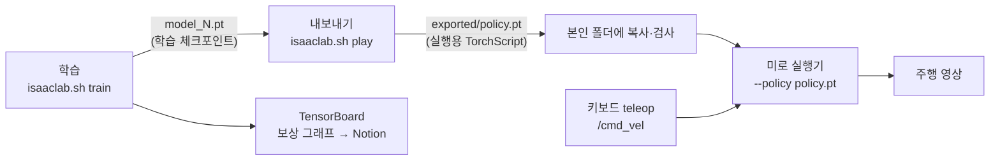

# 3주차 보행팀 안내 — 학습한 Go2 보행 정책을 미로에 적용

Isaac Lab의 Go2 평지 보행 예제로 **속도 명령을 따라 걷는 정책**을 직접 학습하고, 실행용 `.pt`로 내보내, 2주차 미로에서 키보드 teleop으로 주행합니다. 미로의 길을 스스로 찾는 정책은 이번 과제가 아닙니다. 과제 요구 사항은 [go2-rl-gait-task.md](go2-rl-gait-task.md), 실행 파일은 [preparation/](preparation/README.md), 예시 답안은 [Solution-HJ1/](Solution-HJ1/README.md)에 있습니다.

## 실행 환경

| 항목 | 기준 |
| --- | --- |
| OS / GPU | Ubuntu 24.04, NVIDIA RTX GPU ([GPU·학습 시간 안내](preparation/docs/gpu_and_time.md)) |
| 시뮬레이터 | Isaac Sim 6.0.1 + Isaac Lab **v3.0.0-beta2** (2주차와 같음) |
| 강화학습 | RSL-RL **5.0.1**, PPO |
| 학습 작업 | `Isaac-Velocity-Flat-Unitree-Go2-v0` — 2주차 미로 실행기와 관측·행동 정의가 같음 |
| teleop | ROS 2 Jazzy `teleop_twist_keyboard` → `/cmd_vel` (2주차와 같음) |

## 전체 흐름

## 정책이 보고, 내고, 배우는 것

| 구분 | 내용 | 자세히 |
| --- | --- | --- |
| 관측 48개 | 몸체 선속도·각속도, 중력 방향, **속도 명령 `[vx, vy, wz]`**, 관절 각도·속도, 직전 행동 | [rl_basics.md](preparation/docs/rl_basics.md#2-관측--정책이-보는-48개-값) |
| 행동 12개 | 4개 다리 × (엉덩이, 허벅지, 종아리) 관절 목표 = 기본 각도 + 0.25 × 출력 | [rl_basics.md](preparation/docs/rl_basics.md#3-행동--정책이-내는-12개-값) |
| 보상 | 명령 속도 추종(+1.5, +0.75), 발 들기(+0.25), 흔들림·기울기·토크·급한 동작 벌점 | [rl_basics.md](preparation/docs/rl_basics.md#4-보상--무엇을-잘했다고-볼까) |
| 학습 | 4096대 병렬, iteration마다 24스텝 수집 후 PPO 갱신, 기본 300 iteration | [isaaclab_rslrl.md](preparation/docs/isaaclab_rslrl.md) |

teleop은 관측의 **속도 명령 칸**(9–11번)에 값을 넣는 일입니다. 정책은 그 명령을 따라가도록 학습되었으므로 키보드로 바꾼 명령에 맞춰 걷습니다 ([teleop 흐름](preparation/docs/teleop_flow.md)).

## 두 종류의 `.pt`

| 파일 | 무엇 | 제출 |
| --- | --- | --- |
| `model_<iter>.pt` | 학습 체크포인트 (actor·critic·optimizer 상태) | X |
| `exported/policy.pt` | 실행용 정책 (TorchScript, 입력 `[N, 48]` → 출력 `[N, 12]`, 약 170 KiB) | **O** |

자세한 형식과 확인 방법: [policy_format.md](preparation/docs/policy_format.md)

## 실습 순서

1. **2주차 실행기 확인**: [preparation](preparation/README.md)의 `run_teleop_policy.sh`를 옵션 없이 실행해 제공 정책(공개 사전학습)으로 미로를 주행해 봅니다. 이것이 비교 기준입니다.
2. **학습**: `bash scripts/train_go2_flat.sh --run_name 본인ID`. 기본 설정으로 먼저 한 번 끝까지 학습하고, 원한다면 보상·명령 범위 등을 바꿔 다시 학습합니다. 바꾼 값과 이유를 기록합니다.
3. **학습 기록**: `bash scripts/tensorboard.sh`에서 `Train/mean_reward`, `Train/mean_episode_length` 등을 캡처해 Notion에 남깁니다.
4. **내보내기·검사**: `bash scripts/export_policy.sh <run>/model_299.pt ../본인폴더/policy/policy.pt`. 마지막에 `inspect_policy.py`가 `OK`를 출력해야 합니다.
5. **미로 주행**: `bash scripts/run_teleop_policy.sh --policy ../본인폴더/policy/policy.pt --maze-usd <2주차 본인 미로> --spawn <X> <Y> 0.42 --spawn-yaw <도>` + `bash scripts/teleop.sh`. 기본 시작 위치는 연습용 `assets/sample_maze.usda`에만 맞으므로 본인 미로의 통로 위치를 지정합니다(예: 2주차 `week2-gait/ChanwonJung` 미로는 `--spawn -4.15 -3.2 0.42`). 제출 영상은 **2주차 미로**에서 전진·회전·정지를 포함해 촬영합니다. 시작 시 출력되는 `[INFO] Go2 policy: exported TorchScript …`가 보이면 좋습니다.
6. **비교 관찰**: 같은 명령에서 제공 정책과 본인 정책의 걸음새, 속도 추종(`[STATUS]` 출력), 정지 자세, 회전 반응을 비교합니다.
7. **README·Notion·PR**: 아래 체크리스트를 확인하고 PR을 올립니다.

## 제출물 체크리스트

| 과제 요구 | 예 |
| --- | --- |
| 본인이 학습하여 내보낸 실행용 `.pt` | `week3-gait/본인/policy/policy.pt` + 원본 run·iteration·sha256 기록 |
| 정책 실행에 필요한 환경·입출력 설정과 변경 코드 | 사용한 학습 명령(override 포함), 관측 48·행동 12 설명, 수정한 코드나 사용한 실행 명령 |
| 학습 및 정책 적용·실행 방법 `README.md` | 학습 → 내보내기 → 미로 실행 명령 |
| 본인 정책으로 2주차 미로 teleop 주행 영상 | 전진·회전·정지 포함, 정책 파일 이름이 보이면 좋음 |
| Notion | 학습 설정·변경 항목, 보상 그래프, 문제와 해결 시도, 제공 정책과의 차이 |

## 완료 시 설명할 내용과 참고 문서

| 질문 | 참고 |
| --- | --- |
| 관측·행동·보상은 각각 어떤 역할인가? | [rl_basics.md](preparation/docs/rl_basics.md) |
| 저장한 정책을 어떻게 적용했는가? | [policy_format.md](preparation/docs/policy_format.md), [isaaclab_rslrl.md §6](preparation/docs/isaaclab_rslrl.md#6-불러오기) |
| teleop 명령이 정책에 어떻게 전달되는가? | [teleop_flow.md](preparation/docs/teleop_flow.md) |

성능 향상보다 **직접 학습하고, 저장하고, 다시 불러와 실행하는 과정**을 확인하는 것이 목표입니다. 학습이 기대만큼 되지 않았다면 그 결과와 시도한 내용을 그대로 기록합니다.
