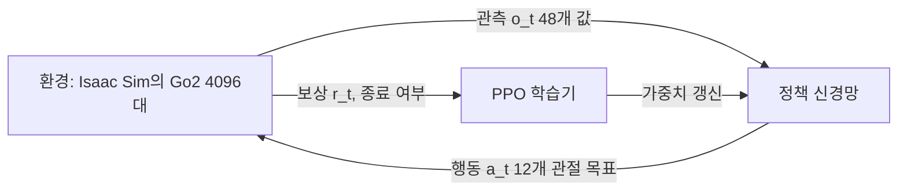

# 강화학습 기초 — Go2 속도 추종 작업으로 보기

이 문서는 과제에서 설명해야 하는 **관측·행동·보상의 역할**을 실제 Go2 학습 설정에 맞춰 정리합니다. 값은 Isaac Lab v3.0.0-beta2의 `isaaclab_tasks/manager_based/locomotion/velocity/`(이하 `velocity/`) 설정에서 확인했습니다.

## 1. 강화학습의 구성 요소

강화학습은 **에이전트**(정책)가 **환경**과 상호작용하며 누적 보상이 커지도록 행동 규칙을 고치는 방법입니다.



| 용어 | 의미 | Go2 작업에서 |
| --- | --- | --- |
| 관측 (observation) | 정책이 매 순간 보는 값 | 몸체 속도·자세, 속도 명령, 관절 상태, 직전 행동 (48개) |
| 행동 (action) | 정책의 출력 | 12개 관절 위치 목표 |
| 보상 (reward) | 행동이 좋았는지 알려 주는 숫자 | 명령 속도를 잘 따르면 +, 흔들림·큰 토크·급한 동작은 − |
| 에피소드 | 시작부터 종료까지 한 번의 시도 | 최대 20초, 몸통이 바닥·물체에 닿으면 종료 |
| 정책 (policy) | 관측 → 행동 함수 | 128-128-128 은닉층의 MLP |

정책은 50 Hz로 동작합니다. 물리 시뮬레이션은 0.005초(200 Hz) 간격이고, 같은 행동을 4번(`decimation=4`) 적용한 뒤 다음 관측을 만듭니다.

## 2. 관측 — 정책이 보는 48개 값

평지 작업은 거친 지형용 높이 스캔(187개)을 제거하므로 관측은 48차원입니다. 순서가 곧 입력 벡터의 위치입니다.

| 위치 | 항목 | 크기 | 내용 | 학습 중 노이즈 |
| --- | --- | --- | --- | --- |
| 0–2 | `base_lin_vel` | 3 | 몸체 좌표계의 선속도 | ±0.1 |
| 3–5 | `base_ang_vel` | 3 | 몸체 좌표계의 각속도 | ±0.2 |
| 6–8 | `projected_gravity` | 3 | 몸체 좌표계로 본 중력 방향 (기울기) | ±0.05 |
| 9–11 | `velocity_commands` | 3 | 따라야 할 명령 `[vx, vy, wz]` — teleop 값이 들어가는 곳 | 없음 |
| 12–23 | `joint_pos` | 12 | 관절 각도 − 기본 자세 각도 | ±0.01 |
| 24–35 | `joint_vel` | 12 | 관절 속도 | ±1.5 |
| 36–47 | `actions` | 12 | 직전 스텝의 정책 출력(스케일 전 값) | 없음 |

- 학습 때는 균일 노이즈를 더해(`enable_corruption=True`) 센서 오차에 강하게 만듭니다. PLAY 설정과 미로 실행기는 노이즈를 끕니다.
- 12개 관절은 PhysX 기준으로 엉덩이 4개(FL, FR, RL, RR) → 허벅지 4개 → 종아리 4개 순서입니다. 실행 중 `env.unwrapped.scene["robot"].joint_names`로 확인할 수 있습니다.
- `base_lin_vel`은 실제 로봇에서 직접 측정하기 어려운 값입니다. 시뮬레이션에서는 정확한 값을 줍니다.

## 3. 행동 — 정책이 내는 12개 값

행동은 각 관절의 목표 각도가 **기본 자세에서 얼마나 벗어날지**(오프셋)를 나타냅니다. 직전 목표에 더하는 증분이 아니라 매 스텝 기본 자세를 기준으로 다시 정하며, 환경이 아래처럼 실제 목표 각도로 바꿉니다.

```text
관절 목표 = 기본 자세 각도 + 0.25 × 정책 출력
```

기본 자세는 엉덩이 ±0.1, 앞 허벅지 0.8, 뒤 허벅지 1.0, 종아리 −1.5 rad입니다. 각 관절의 DC 모터 모델(강성 25, 감쇠 0.5, 최대 토크 23.5 N·m)이 목표 각도로 관절을 움직입니다. 출력값을 자르는(clip) 설정은 없습니다.

## 4. 보상 — 무엇을 잘했다고 볼까

매 스텝 보상은 아래 항목의 `함수값 × 가중치 × 0.02초` 합입니다(Go2 평지 최종값).

| 항목 | 가중치 | 의미 |
| --- | --- | --- |
| `track_lin_vel_xy_exp` | +1.5 | 명령 `vx, vy`와 실제 몸체 속도가 가까울수록 큼 (`exp(-오차²/0.25)`) |
| `track_ang_vel_z_exp` | +0.75 | 명령 회전 속도 `wz`를 잘 따를수록 큼 |
| `feet_air_time` | +0.25 | 발이 착지할 때 (공중에 있던 시간 − 0.5초)만큼 더함 — 짧게 끌면 −, 충분히 들면 + (명령이 0.1 m/s 이하이면 0) |
| `lin_vel_z_l2` | −2.0 | 위아래로 튀는 움직임 벌점 |
| `ang_vel_xy_l2` | −0.05 | 앞뒤·좌우로 흔들리는 회전 벌점 |
| `flat_orientation_l2` | −2.5 | 몸통이 기울어지면 벌점 |
| `dof_torques_l2` | −0.0002 | 큰 관절 토크 벌점 (에너지) |
| `dof_acc_l2` | −2.5e-7 | 급한 관절 가속 벌점 |
| `action_rate_l2` | −0.01 | 직전 행동과 크게 다른 행동 벌점 (떨림 방지) |

추적 보상(+)이 "무엇을 할지", 벌점(−)이 "어떻게 할지"를 정합니다. 가중치를 바꾸면 걸음새가 달라지므로 변경했다면 Notion에 이유와 결과를 함께 기록합니다. TensorBoard의 `Episode_Reward/<항목>`은 에피소드 합을 20초로 나눈 값이라 위 가중치와 크기가 다릅니다.

## 5. 명령·종료·무작위화

- **속도 명령**: 학습 중 `vx, vy, wz`를 각각 −1에서 1 사이에서 10초마다 새로 뽑습니다. 기본 설정은 목표 방향(heading)을 뽑고 `wz = 0.5 × 방향 오차`(−1에서 1 사이로 제한)로 회전 명령을 매 스텝 다시 계산하며, 2%의 로봇은 정지 명령(0)을 받습니다.
- **종료**: 20초가 지나거나(시간 종료) 몸통(`base`)에 1 N이 넘는 접촉이 생기면 에피소드가 끝납니다.
- **무작위화**: 몸통 질량 ×0.8–1.25, 무게중심 ±5 cm, 시작 위치 ±0.5 m·방향 ±π, 시작 관절각 ×0.5–1.5, 10–15초마다 ±0.5 m/s로 밀기. 다양한 상황에서 넘어지지 않는 정책을 얻기 위한 설정입니다. PLAY 설정은 관측 노이즈와 밀기를 끄고, 미로 실행기는 시작 위치·방향·관절각의 무작위화도 끕니다.

## 6. PPO — 정책을 고치는 방법

RSL-RL의 PPO(Proximal Policy Optimization)는 아래를 반복합니다. 이 반복 한 번이 **iteration**입니다.

1. **데이터 수집**: 4096대가 각각 24스텝(0.48초)씩 움직여 98,304개의 (관측, 행동, 보상) 기록을 모읍니다.
2. **이점(advantage) 계산**: 가치 함수(critic)가 예측한 미래 보상과 실제를 비교해 각 행동이 평균보다 얼마나 좋았는지 계산합니다 (`gamma=0.99`, `lam=0.95`).
3. **정책 갱신**: 좋았던 행동의 확률을 높이되, 한 번에 너무 크게 바뀌지 않도록 변화 비율을 0.8~1.2로 제한합니다(`clip_param=0.2`). 같은 데이터로 5 epoch × 4 mini-batch 학습합니다.

| 설정 | 값 |
| --- | --- |
| actor·critic 신경망 | 은닉층 [128, 128, 128], ELU |
| 행동 분포 | 가우시안, 초기 표준편차 1.0 (학습 중 탐색), 내보낸 정책은 평균값만 사용 |
| 학습률 | 1e-3, KL 목표 0.01에 맞춰 자동 조절 (`adaptive`) |
| 엔트로피 계수 | 0.01 (탐색 유지) |
| iteration / 저장 간격 | 300 / 50 |

학습 중에는 확률적으로 행동을 뽑아 탐색하고, 내보낸 `policy.pt`는 같은 관측에 항상 같은 행동(평균)을 냅니다.

## 7. 직접 확인할 질문

- 관측의 9–11번에 teleop 명령이 들어가지 않으면 정책은 어떻게 움직일까?
- `track_lin_vel_xy_exp` 가중치를 낮추고 `flat_orientation_l2` 벌점을 키우면 무엇이 달라질까?
- 학습 명령 범위(±1 m/s) 밖의 teleop 명령(예: 1.5 m/s)을 주면 어떻게 될까? 미로 실행기가 `vx`를 ±0.8로 제한하는 이유와 연결해 보세요.

## 참고 자료

- [Isaac Lab — Training with an RL agent](https://isaac-sim.github.io/IsaacLab/main/source/tutorials/03_envs/run_rl_training.html), [Manager-based 환경 구조](https://isaac-sim.github.io/IsaacLab/main/source/tutorials/03_envs/create_manager_rl_env.html)
- [Proximal Policy Optimization (Schulman et al., 2017)](https://arxiv.org/abs/1707.06347)
- [Learning to Walk in Minutes Using Massively Parallel Deep RL (Rudin et al., 2022)](https://arxiv.org/abs/2109.11978): RSL-RL과 이 보상 구성의 바탕
- [Spinning Up — Key Concepts in RL](https://spinningup.openai.com/en/latest/spinningup/rl_intro.html)
