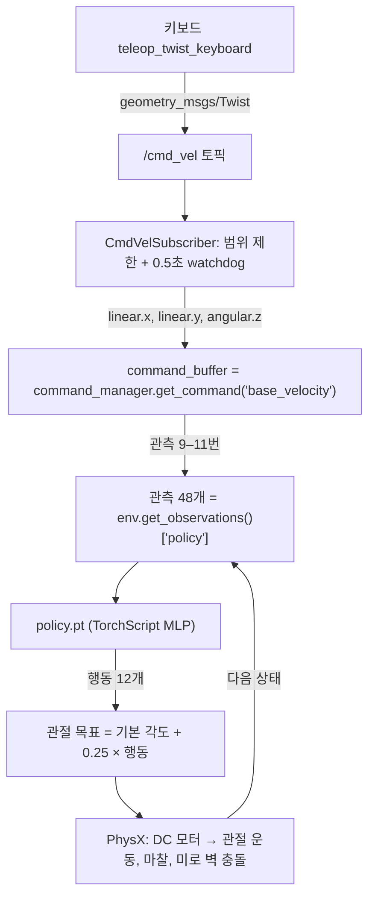

# teleop 명령이 정책에 전달되는 흐름

과제의 "teleop 명령이 정책에 전달되는 흐름"과 "저장한 정책의 적용 방법"을 `go2_policy_teleop.py` 코드 순서대로 정리합니다.

## 단계별 설명

1. **키보드 → `/cmd_vel`**: `teleop_twist_keyboard`가 누른 키를 `Twist` 메시지로 발행합니다. 미로 실행기는 Isaac Sim 내장 ROS 2 Jazzy rclpy로 같은 토픽을 구독합니다(같은 `ROS_DOMAIN_ID` 필요).
2. **범위 제한·watchdog**: `vx`는 ±0.8 m/s, `vy`는 ±0.4 m/s, `wz`는 ±1.0 rad/s로 자릅니다. 학습 명령 범위(±1.0) 안에 머물게 하여 정책이 배운 적 없는 명령을 받지 않도록 합니다. 마지막 메시지 후 0.5초가 지나면 명령을 0으로 바꿔 정지시킵니다.
3. **명령 버퍼에 쓰기**: `command_manager.get_command("base_velocity")`는 복사본이 아닌 **명령 텐서 자체**입니다. 여기에 `[vx, vy, wz]`를 쓰면 다음 관측 계산에 그대로 들어갑니다. 학습에서는 명령을 무작위로 뽑고 방향 오차로 `wz`를 다시 계산하지만, `Go2MazeEnvCfg`가 이를 모두 끄고(heading 끔, 재추첨 1e9초, 범위 0) teleop이 명령을 소유하게 합니다.
4. **관측 만들기**: `env.get_observations()`가 몸체 속도·각속도·기울기, 방금 쓴 명령(9–11번), 관절 상태, 직전 행동을 이어 붙인 48개 값을 만듭니다.
5. **정책 실행**: `actions = policy(obs["policy"])` — 12개 값을 냅니다. 같은 관측이면 항상 같은 행동입니다.
6. **환경 진행**: `env.step(actions)`이 행동을 관절 목표 각도로 바꾸고, 물리를 0.005초씩 4번 진행한 뒤 종료·보상·명령 갱신·관측을 처리합니다. 한 번에 0.02초(50 Hz)입니다.
7. **명령 다시 쓰기**: `env.step()` 안에서 명령 관리자가 명령을 갱신하거나 에피소드 재시작 때 다시 뽑을 수 있으므로, step 뒤에 teleop 명령을 한 번 더 씁니다.
8. **실시간 맞추기**: 한 바퀴가 0.02초보다 빨리 끝나면 남은 시간만큼 기다려 실제 시간과 같은 속도로 보여 줍니다.

## 저장한 정책을 적용하는 방법

| 실행 | 정책 | 불러오기 |
| --- | --- | --- |
| `run_teleop_policy.sh` | 제공 정책 (Isaac Lab 공개 사전학습 체크포인트) | `OnPolicyRunner.load` → `get_inference_policy` |
| `run_teleop_policy.sh --checkpoint model_299.pt` | 본인 학습 체크포인트 | 같음 (기본 신경망 크기일 때만) |
| `run_teleop_policy.sh --policy policy.pt` | **본인이 내보낸 실행용 정책 (제출물)** | `torch.jit.load` → `policy(obs["policy"])` |

시작할 때 `[INFO] Go2 policy: exported TorchScript …/policy.pt (sha256 …)`가 출력되므로 영상에 이 줄이 보이게 촬영하면 어떤 정책으로 주행했는지 증명할 수 있습니다.

## 미로에서 알아 둘 동작

- **벽 충돌 → 재시작**: 학습 환경의 종료 조건(몸통 접촉 1 N 초과)이 그대로 있어서 몸통이 벽에 닿으면 에피소드가 끝나고 시작 위치에서 다시 시작합니다. 다리만 닿는 것은 종료 조건이 아닙니다.
- **에피소드 길이**: 미로 환경은 60분으로 늘려 시간 종료로 재시작되는 일이 없게 했습니다.
- **정지 명령**: `k`를 누르거나 0.5초 동안 키를 누르지 않으면 명령 0 → 제자리에 서 있습니다. 학습 중 정지 명령은 전체의 2%뿐이라, 정책에 따라 제자리에서 발을 구르거나 미세하게 움직일 수 있습니다. 제공 정책과 본인 정책의 차이를 관찰하기 좋은 지점입니다.
- **[STATUS] 출력**: `cmd vx=+0.50 … | measured vx=+0.47 …`처럼 명령과 실제 몸체 속도(관측 0–5번)를 2초마다 보여 줍니다. 회전·전진에서 어느 쪽이 더 잘 따라가는지 비교에 사용합니다.
