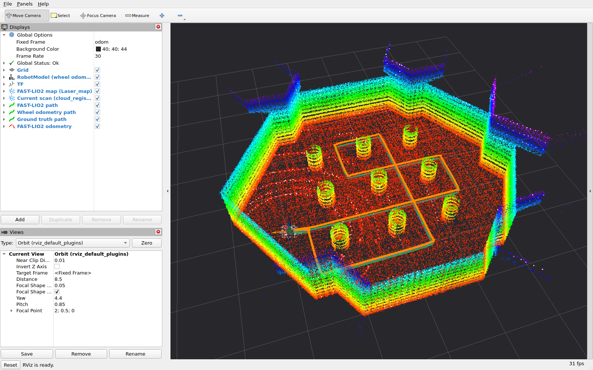
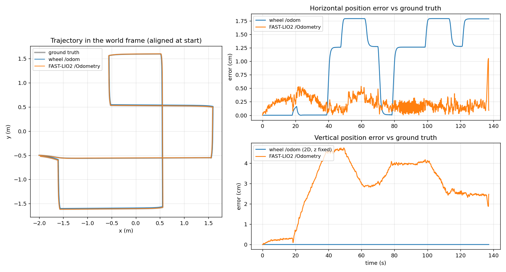

# 3주차 인지팀 예시 답안 — FAST-LIO2 odometry·지도 추정과 RViz 표시 (HJ1)

[과제](../fastlio2-rviz-task.md)의 제출 형식을 보여 주는 예시 답안입니다. 실행 환경은 [제공 환경](../preparation/README.md), 개념과 순서는 [인지팀 안내](../guide.md)를 따릅니다.

[](media/fastlio_rviz.mp4)

## 과제 목표와 구현 내용

- 2주차 Burger 시뮬레이션의 16채널 3D LiDAR와 IMU로 FAST-LIO2를 실행해 odometry와 3D 점군 지도를 추정하고 RViz에 표시합니다.
- 같은 RViz 화면에 바퀴 odometry와 시뮬레이터 정답 궤적을 함께 그리고, 기록 도구로 두 odometry의 오차를 수치로 비교합니다.
- 같은 녹화 데이터를 설정만 바꿔 다시 처리해 설정의 영향을 확인했습니다.

## 제공 자료와 직접 작성한 부분

| 구분 | 파일 | 내용 |
| --- | --- | --- |
| 제공 (수정 없음) | `../preparation/` | 시뮬레이션, `points_to_fastlio.py`, FAST-LIO2 기본 설정·빌드 스크립트 |
| 작성 | [launch/fast_lio_rviz.launch.py](launch/fast_lio_rviz.launch.py) | 기본 설정 + 개인 변경 병합(없는 키는 오류), `odom → camera_init` 정적 TF, RViz, 지도 저장 경로 |
| 작성 | [config/fast_lio_overrides.yaml](config/fast_lio_overrides.yaml) | 지도 저장(`/map_save`) 켜기 |
| 작성 | [config/experiments/](config/experiments/) | 설정 실험용 변경 파일 3개 |
| 작성 | [rviz/fast_lio.rviz](rviz/fast_lio.rviz) | Fixed Frame `odom`, FAST-LIO2 지도·현재 스캔·궤적, 바퀴·정답 궤적 |
| 작성 | [tools/odom_compare.py](tools/odom_compare.py) | `/odom`, `/Odometry`, `/ground_truth/odom` 기록 → 같은 기준으로 맞춰 오차 계산 → CSV·`metrics.json`·그래프, RViz용 궤적 발행 |
| 작성 | [tools/drive_route.py](tools/drive_route.py) | 기둥 사이 고정 경로 주행 (반복 비교용, teleop으로 대체 가능) |
| 작성 | [scripts/](scripts/) | 위 도구를 `env.sh` 환경으로 실행 |
| 결과 | [media/](media/) | 스크린샷, 영상, 그래프, 수치 |

## 실행 환경

| 항목 | 값 |
| --- | --- |
| OS / ROS 2 / 시뮬레이터 | WSL2 Ubuntu 24.04.4, ROS 2 Jazzy, Gazebo Sim 8.11.0 |
| FAST-LIO2 | hku-mars/FAST_LIO `ROS2` 커밋 `a4743b0` + 제공 C++17 패치 |
| PC | Intel i5-14600KF, RTX 4070 SUPER (Gazebo GPU LiDAR) |
| 영상 | RViz 화면을 ffmpeg로 1280×800, 10 fps 녹화 |

## 실행 방법

`week3-slam/Solution-HJ1`에서 터미널 4개를 사용합니다. 제공 환경의 설치·빌드([preparation/README.md](../preparation/README.md#설치와-빌드-처음-한-번))를 먼저 마칩니다. launch와 스크립트가 `../preparation`을 찾으므로 이 폴더를 복사해 시작할 때는 `week3-slam/<본인이름>/`처럼 `preparation`과 같은 단계에 둡니다.

```bash
# 1) 시뮬레이션 (Gazebo 창·센서 RViz 없이)
bash ../preparation/scripts/run_simulation.sh headless:=True use_rviz:=False

# 2) FAST-LIO2 + RViz — 로봇이 정지한 상태에서 시작하고 "IMU Initial Done" 확인
bash scripts/run_fast_lio_rviz.sh

# 3) 비교 기록 — Ctrl+C로 끝내면 results/<시각>/에 CSV, metrics.json, trajectories.png 생성
bash scripts/run_compare.sh

# 4) 주행 — 고정 경로 또는 키보드
bash scripts/run_route.sh            # 또는 bash ../preparation/scripts/run_teleop.sh
```

주행이 끝나면 3번 터미널에서 `Ctrl+C`를 누르고, 지도를 저장하려면 다른 터미널에서 아래를 실행합니다(`source ../preparation/scripts/env.sh` 후).

```bash
ros2 service call /map_save std_srvs/srv/Trigger    # -> results/fastlio_map.pcd
```

`results/`는 git에 올라가지 않습니다(`week3-slam/.gitignore`). 제출할 영상·스크린샷·그래프·`metrics.json`은 `media/`로 복사해 README에서 링크합니다.

## 센서 토픽과 좌표계

| 입력 | 타입 | 프레임 | 주기 |
| --- | --- | --- | --- |
| `/points_fastlio` | `sensor_msgs/msg/PointCloud2` (x, y, z, intensity, ring) | `lidar_3d_link` | 10 Hz, 약 11,170점 |
| `/imu` | `sensor_msgs/msg/Imu` | `imu_link` | 200 Hz |

| 출력 | 타입 | 프레임 | 용도 |
| --- | --- | --- | --- |
| `/Odometry` | `nav_msgs/msg/Odometry` | `camera_init` → `body` | 추정 위치·자세 (10 Hz) |
| `/path` | `nav_msgs/msg/Path` | `camera_init` | 추정 궤적 |
| `/cloud_registered` | `PointCloud2` | `camera_init` | 지도 좌표로 옮긴 현재 스캔 |
| `/Laser_map` | `PointCloud2` | `camera_init` | 누적 지도 (1초마다 갱신) |
| `/wheel_odom/path`, `/ground_truth/path` | `nav_msgs/msg/Path` | `odom` | 비교용 (`odom_compare.py`가 발행) |

```text
odom ─ Gazebo 바퀴 odometry ─> base_footprint ─> base_link ─> imu_link, lidar_3d_link
 └─ 정적 TF (-0.032, 0, 0.078) ─> camera_init ─ FAST-LIO2 ─> body
```

- `camera_init`은 FAST-LIO2를 시작한 순간의 `imu_link`입니다. 로봇이 `odom` 원점에 정지한 채 시작하므로 `base_footprint`에서 본 `imu_link` 위치(URDF: x −0.032, z 0.068 + `base_link` 높이 0.010)를 정적 TF로 연결했습니다. 그래서 RViz에서 `body`(FAST-LIO2 추정)와 `imu_link`(바퀴 odometry 기준)가 같은 화면에 그려집니다.
- `body`를 `base_link`의 부모로 연결하지 않았습니다. `base_link`는 이미 `base_footprint`의 자식이기 때문입니다.
- 모든 노드는 `use_sim_time: true`입니다.

## 결과

FAST-LIO2를 시작한 뒤 [drive_route.py](tools/drive_route.py)로 기둥 사이를 한 바퀴(약 15.6 m, 제자리 회전 8회) 돌았습니다.

- **영상**: [media/fastlio_rviz.mp4](media/fastlio_rviz.mp4) — FAST-LIO2 시작 직후부터 주행 종료까지 1배속. 처음에는 첫 스캔으로 만든 성긴 지도에서 시작해, 로봇이 움직일수록 벽·기둥이 채워지고 주황색 궤적(`/path`)이 늘어납니다.
- **스크린샷**: [media/rviz_fastlio_map.png](media/rviz_fastlio_map.png) — 주행 후 지도(높이별 색)와 궤적. 바퀴·정답 궤적(파랑·초록)은 FAST-LIO2 궤적과 수 mm~2 cm 차이라 거의 겹칩니다.
- **비교 그래프**: [media/trajectories.png](media/trajectories.png), 수치: [media/metrics.json](media/metrics.json)



| 정답 위치 대비 | 바퀴 `/odom` | FAST-LIO2 `/Odometry` |
| --- | --- | --- |
| 수평 위치 RMSE | 1.25 cm | 0.24 cm |
| 수평 최대 / 종료 시 오차 | 1.79 / 1.79 cm | 1.05 / 0.09 cm |
| 수직(z) 최대 오차 | — (2D, z 고정) | 4.8 cm |
| 방향 최대 오차 | 0.01° | 0.12° |
| 발행 주기 (측정) | 29.4 Hz | 9.94 Hz |

시작 위치를 정답에 맞춘 뒤의 오차입니다(FAST-LIO2는 3D, 2D인 바퀴 odometry는 x·y·방향만 맞춤). `/Odometry`는 IMU 위치이므로 URDF의 IMU 위치로 `base_footprint`를 계산해 비교했습니다.

## FAST-LIO2의 입력과 출력

- **입력**: 3D LiDAR 점군(`/points_fastlio`)과 IMU(`/imu`), 그리고 두 센서의 상대 위치(외부 파라미터 `extrinsic_T: [0.0, 0.0, 0.192]`). IMU의 각속도·가속도로 다음 스캔까지의 움직임을 예측하고, 스캔의 점들을 지금까지 만든 지도의 평면에 맞춰 예측을 고칩니다.
- **출력**: IMU의 6자유도 위치·자세(`/Odometry`, TF `camera_init → body`), 궤적(`/path`), 지도 좌표로 옮긴 스캔(`/cloud_registered`)과 누적 지도(`/Laser_map`). 바퀴 정보는 쓰지 않습니다.

## 기존 TurtleBot odometry와 FAST-LIO2 odometry의 차이

| | 바퀴 odometry `/odom` | FAST-LIO2 `/Odometry` |
| --- | --- | --- |
| 센서 | 바퀴 관절 회전량 | 3D LiDAR + IMU |
| 추정하는 것 | 2D (x, y, 방향) | 3D (위치 + 자세) |
| 기준점 | `base_footprint` (바닥, 바퀴 축 가운데) | `body` = IMU (`base_footprint`에서 x −3.2 cm, z +7.8 cm) |
| 기준 프레임 | `odom` = 시작 위치 | `camera_init` = 시작 순간의 IMU |
| 주기 | 30 Hz | LiDAR 스캔마다 10 Hz |
| 오차 원인 | 바퀴 미끄러짐, 바퀴 크기·간격 오차, 바닥 | 특징 없는 환경, 외부 파라미터·시간 오차, 수직 방향 관측 약함 |
| 지도 | 만들지 않음 | 점군 지도를 함께 만듦 |

관찰한 점:

1. **바퀴 odometry의 오차는 방향에만 따라 변했습니다.** 시작 방향(동쪽)을 볼 때 0 cm, 90° 돌았을 때 1.27 cm, 180°일 때 1.79 cm(≈ 1.27 × √2)였고, 직진하는 동안은 늘지 않았습니다. 제자리 회전 때 실제 회전 중심이 바퀴 축 가운데와 약 0.9 cm 어긋나는데 바퀴 회전량에는 이 이동이 나타나지 않는 것으로 해석했습니다. 시뮬레이션 바퀴는 거의 미끄러지지 않아 오차가 작지만, 실제 TurtleBot은 바닥·속도에 따라 훨씬 큰 오차가 쌓입니다.
2. **FAST-LIO2의 수평 오차는 방향과 관계없이 작았습니다.** 99%가 0.5 cm 이하였고, 최대 1.05 cm는 주행이 끝난 뒤 `/map_save`로 지도를 저장한 직후 한 번 나온 값입니다(저장하는 동안 처리가 잠시 밀린 것으로 보입니다). 매 스캔을 주변 벽·기둥에 직접 맞추므로 회전 중 미끄러짐도 측정에 반영됩니다.
3. **대신 FAST-LIO2는 높이가 수 cm 변했습니다.** 동쪽으로 갈 때 커지고 서쪽으로 갈 때 줄어, 추정 좌표계가 수평면에서 약 0.57° 기울어진 것과 같은 모양입니다. 바퀴 odometry는 처음부터 높이를 0으로 두므로 이런 오차가 없지만 언덕이나 턱도 알 수 없습니다.
4. 두 odometry는 **기준점이 다릅니다.** IMU는 `base_footprint`에서 뒤쪽으로 3.2 cm 떨어져 있어 제자리 회전만 해도 반지름 3.2 cm 원을 그립니다. `/Odometry`를 그대로 `/odom`과 비교하면 방향에 따라 최대 6.4 cm 차이가 보이므로 `base_footprint` 위치로 바꾼 뒤 비교했습니다.

## 설정 실험 — 같은 데이터를 다시 처리

시뮬레이션 주행을 `ros2 bag`으로 한 번 녹화하고, FAST-LIO2 설정만 바꿔 다시 재생하며 `odom_compare.py`로 비교했습니다. 같은 센서 데이터이므로 차이는 설정 때문입니다.

```bash
# 녹화 — 시뮬레이션·주행 중 별도 터미널에서 (env.sh 없이 실행하면 다른 ROS 도메인이라 빈 bag이 됨)
source ../preparation/scripts/env.sh && ros2 bag record -s mcap -o ~/bags/run1 /clock /points_fastlio /imu /odom /ground_truth/odom /tf /tf_static
# 재처리 (시뮬레이션 없이, 터미널 3개)
bash scripts/run_fast_lio_rviz.sh use_rviz:=False overrides_file:=config/experiments/voxel_0.2.yaml
bash scripts/run_compare.sh --output-dir results/voxel_0.2
source ../preparation/scripts/env.sh && ros2 bag play ~/bags/run1    # 끝나면 비교 터미널 Ctrl+C
```

| 설정 | 수평 RMSE | 수평 최대 | 방향 최대 | 해석 |
| --- | --- | --- | --- | --- |
| 기본 설정 (녹화 데이터 재처리) | 0.47 cm | 0.81 cm | 0.14° | 위 결과 표(실시간 처리)와 같은 수준 |
| [voxel_0.2](config/experiments/voxel_0.2.yaml): 다운샘플 0.1 → 0.2 m | 0.89 cm | 1.82 cm | 0.43° | 기둥(지름 0.3 m)의 점이 줄어 정합이 약해짐 |
| [lidar_type_2](config/experiments/lidar_type_2.yaml): Velodyne 처리기 | 2.44 cm | 5.46 cm | 8.57° | 없는 점별 시각을 방위각으로 추정해 회전 중 스캔이 비틀리고, 출력 시각도 약 0.1초 늦어짐 |
| [extrinsic_x_0.15](config/experiments/extrinsic_x_0.15.yaml): LiDAR 위치 15 cm 오류 | 22.8 cm | 30.9 cm | 0.13° | 반대 방향을 볼 때 2 × 15 cm까지 위치가 어긋남 |

이 실험은 제공 설정의 `cube_side_length`가 50이던 때 측정했습니다. 현재 값(100)으로 기본 설정을 다시 처리해도 수평 RMSE 0.46 cm로 같았습니다.

그래서 제공 기본 설정(일반 처리기, 0.1 m, URDF 외부 파라미터)을 유지하고, 지도 저장만 추가했습니다.

## 개인 Notion 학습 페이지

(링크) — 빌드·실행 중 오류와 해결 과정, 설정 실험 기록, 관찰 내용을 정리합니다.

## 미완료 항목 또는 질문

- Nav2 연결(선택 확장)은 하지 않았습니다. FAST-LIO2의 `camera_init → body`를 `map → odom` 대신 사용하려면 TF 트리를 어떻게 구성해야 하는지가 다음 질문입니다.
- FAST-LIO2 높이 오차가 기울기 모양으로 나타나는 원인(IMU 가속도 바이어스와 기울기 추정의 관계)을 더 확인해 보고 싶습니다.
