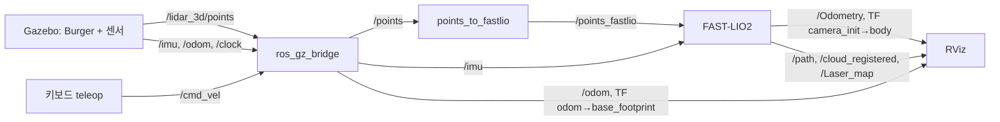

# 3주차 인지팀 안내 — FAST-LIO2 odometry·지도 추정과 RViz 표시

2주차의 TurtleBot3 Burger 시뮬레이션에서 3D LiDAR와 IMU 데이터를 FAST-LIO2에 넣어 로봇의 위치(odometry)와 3D 점군 지도를 추정하고, RViz에서 로봇을 움직이며 결과가 갱신되는 것을 확인합니다. 과제 요구 사항은 [fastlio2-rviz-task.md](fastlio2-rviz-task.md), 실행 환경은 [preparation/](preparation/README.md), 예시 답안은 [Solution-HJ1/](Solution-HJ1/README.md)에 있습니다.

## 실행 환경

| 항목 | 기준 |
| --- | --- |
| 운영체제 / ROS 2 | Ubuntu 24.04 LTS, ROS 2 Jazzy |
| 시뮬레이터 | Gazebo Harmonic (Gazebo Sim 8) |
| 로봇 | TurtleBot3 Burger + 16채널 3D LiDAR + IMU (2주차와 같은 모델) |
| FAST-LIO2 | hku-mars/FAST_LIO `ROS2` 브랜치 커밋 `a4743b0` + Jazzy C++17 패치 |
| 시각화 | RViz 2 |

2주차와 달리 Nav2를 실행하지 않습니다. 로봇은 키보드 teleop으로 움직입니다.

## 센서와 FAST-LIO2 입력

| 센서 | 토픽 | 설정 | FAST-LIO2에서 |
| --- | --- | --- | --- |
| 16채널 3D LiDAR | `/points` → `/points_fastlio` | 10 Hz, 수평 720 × 수직 16, 0.10–20 m | 지도와 맞춰 위치를 고치는 관측 |
| IMU | `/imu` | 200 Hz, 각속도·선형가속도 | 스캔 사이의 움직임 예측 |
| 바퀴 odometry | `/odom` | 30 Hz, 2D | 사용하지 않음 — 비교 대상 |
| 정답 위치 | `/ground_truth/odom` | 50 Hz | 사용하지 않음 — 시뮬레이터 전용 비교 기준 |

Gazebo의 3D 점군에는 측정이 없는 방향의 광선이 무한대 좌표로 들어 있습니다. 제공 시뮬레이션은 이를 뺀 점군을 `/points_fastlio`로 함께 발행합니다. Gazebo는 한 스캔을 한 순간에 측정하므로 점별 측정 시각이 필요 없고, FAST-LIO2 설정은 모든 점을 스캔 시각으로 처리하는 일반 처리기(`lidar_type: 5`)를 사용합니다.

## 데이터 흐름



FAST-LIO2는 IMU로 움직임을 예측하고, 매 스캔의 점들을 지금까지 쌓은 지도의 평면들에 맞춰 예측을 고칩니다. 고친 위치로 스캔을 옮겨 지도에 더하므로 **위치 추정과 지도 작성이 함께** 일어납니다. 자세한 내용은 [FAST-LIO2 교보재](preparation/docs/fastlio2.md)를 참고하세요.

## 좌표계

```text
odom ─(Gazebo 바퀴 odometry)→ base_footprint → base_link → lidar_3d_link, imu_link, base_scan
camera_init ─(FAST-LIO2)→ body
```

- `camera_init`: FAST-LIO2를 **시작한 순간의 IMU 위치·자세**. FAST-LIO2 지도와 궤적의 기준입니다.
- `body`: FAST-LIO2가 추정한 현재 IMU(`imu_link`) 위치·자세. `/Odometry`가 이 값입니다.
- 두 트리는 처음에 연결되어 있지 않습니다. 바퀴 odometry와 한 화면에서 비교하려면 `odom → camera_init` 정적 변환(로봇이 원점에 서 있을 때 시작했다면 `(-0.032, 0, 0.078)`)을 추가합니다.

센서 장착 위치, QoS, 점검 명령은 [센서·토픽·좌표계](preparation/docs/sensors_topics_frames.md)에 있습니다.

## 실습 순서

1. **설치·빌드**: `preparation`에서 `install_dependencies.sh` → `build_fast_lio.sh` → `check_environment.sh`.
2. **센서 확인**: `run_simulation.sh`를 실행하고 `sensors.rviz`에서 로봇, 3D 점군, `/odom`이 보이는지 확인합니다. 점검 명령으로 주기·필드·프레임을 확인합니다.
3. **FAST-LIO2 실행**: 로봇이 **정지한 상태**에서 `run_fast_lio.sh`를 실행하고 `IMU Initial Done`을 확인합니다. 시작 직후의 `No point, skip this scan!` 몇 번은 정상입니다.
4. **이동하며 관찰**: `run_teleop.sh`로 기둥 사이를 천천히 돌며 `/path`가 늘고 `/Laser_map`이 채워지는 것을 봅니다. 급회전보다 0.15 m/s, 0.6 rad/s 정도로 시작합니다.
5. **본인 연결 구성**: 사용할 설정(기본 설정 + 본인 변경), launch, RViz 설정을 본인 폴더 `week3-slam/<본인이름>/`(`preparation`과 같은 단계)에 만듭니다. [예시 답안](Solution-HJ1/README.md)은 바퀴 odometry·정답 위치와 한 화면에서 비교하는 구성이며, 폴더를 복사해 시작해도 됩니다.
6. **기록**: 궤적과 지도가 보이는 RViz 스크린샷, 이동에 따라 갱신되는 영상을 촬영합니다([RViz·촬영 안내](preparation/docs/rviz.md)). `results/` 폴더는 git에 올라가지 않으므로 제출할 파일은 `media/`에 두고 README에서 링크합니다.
7. **비교와 설명**: `/odom`과 FAST-LIO2 `/Odometry`가 무엇이 다른지 관찰하고 정리합니다.

## 제출물 체크리스트

| 과제 요구 | 예 |
| --- | --- |
| FAST-LIO2 연결·실행에 사용한 코드와 launch·설정 파일 | 본인 launch, FAST-LIO2 설정(기본값 대비 변경분), RViz 설정 |
| 센서 토픽·좌표계 및 실행 방법이 포함된 `README.md` | 입력·출력 토픽 표, TF 구조, 터미널별 실행 명령 |
| RViz에서 추정 궤적과 지도가 보이는 스크린샷 | `/path` + `/Laser_map`(또는 누적 `/cloud_registered`) |
| 로봇 이동에 따라 추정 궤적·지도가 갱신되는 영상 | FAST-LIO2 시작 → 이동 → 정지 |
| Notion | 시도한 설정, 오류와 해결 과정, 관찰 결과 |

## 완료 시 설명할 내용

- **FAST-LIO2의 입력과 출력**: 무엇을 받고(점군, IMU, 외부 파라미터), 무엇을 내는지(`/Odometry`, TF, `/path`, 점군·지도).
- **기존 TurtleBot odometry와 FAST-LIO2 odometry의 차이**: 사용하는 센서, 2D/3D, 기준 프레임과 기준점(`base_footprint` / IMU), 발행 주기, 오차가 생기고 쌓이는 원인, 지도를 만드는지 여부. 관찰한 수치나 화면을 근거로 설명합니다.

FAST-LIO2 결과를 Nav2에 다시 연결하는 작업(예: `map → odom`을 FAST-LIO2로 대신하고 점군으로 costmap 만들기)은 선택 확장입니다.
