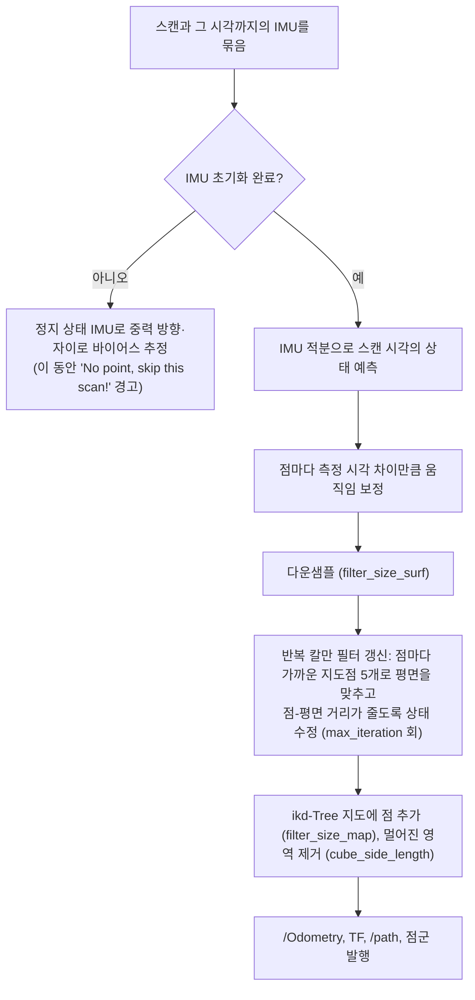

# FAST-LIO2 교보재

이 문서는 FAST-LIO2가 무엇을 입력받아 무엇을 내는지, 이 실습의 기본 설정([config/fast_lio_burger.yaml](../config/fast_lio_burger.yaml))이 왜 그렇게 정해졌는지 설명합니다. 동작 설명은 사용하는 구현 [hku-mars/FAST_LIO](https://github.com/hku-mars/FAST_LIO) `ROS2` 브랜치 커밋 `a4743b0`(2025-01-15)의 코드를 기준으로 합니다.

## 1. FAST-LIO2가 하는 일

FAST-LIO2는 **LiDAR-관성 오도메트리**(LIO)입니다. IMU로 짧은 시간의 움직임을 예측하고, LiDAR 점군을 지금까지 만든 지도에 맞춰 그 예측을 고칩니다. 결과로 로봇(정확히는 IMU)의 6자유도 위치·자세와, 정합한 점들을 쌓은 3D 점군 지도가 나옵니다.

- **강결합(tightly-coupled)**: LiDAR 결과와 IMU 결과를 따로 계산해 합치지 않고, 하나의 필터 안에서 IMU 예측과 점 하나하나의 정합 오차를 함께 사용합니다.
- **직접 정합(direct)**: 모서리·평면 같은 특징을 뽑지 않고 다운샘플한 원시 점을 그대로 지도와 맞춥니다.
- **루프 클로저 없음**: 예전에 왔던 곳을 알아보고 전체 궤적을 다시 맞추는 기능은 없습니다. 오래 움직이면 오차가 조금씩 쌓일 수 있으며, 이 점에서 전체 SLAM보다는 "오도메트리 + 지역 지도 작성"에 가깝습니다.

## 2. 입력과 출력

| 구분 | 이름 | 타입 | 프레임 | 이 실습의 값 |
| --- | --- | --- | --- | --- |
| 입력 | `common.lid_topic` | `sensor_msgs/msg/PointCloud2` | `lidar_3d_link` | `/points_fastlio`, 10 Hz, 한 스캔 약 11,000점 |
| 입력 | `common.imu_topic` | `sensor_msgs/msg/Imu` | `imu_link` | `/imu`, 200 Hz (각속도·선형가속도 사용, 자세 quaternion은 사용 안 함) |
| 출력 | `/Odometry` | `nav_msgs/msg/Odometry` | `camera_init` → `body` | 스캔마다(10 Hz) 추정한 IMU의 위치·자세 (`twist`는 채우지 않아 항상 0) |
| 출력 | TF | `camera_init` → `body` | | `/Odometry`와 같은 값 |
| 출력 | `/path` | `nav_msgs/msg/Path` | `camera_init` | 지나온 궤적, 10스캔마다 한 점 추가 |
| 출력 | `/cloud_registered` | `PointCloud2` | `camera_init` | 지금 스캔을 지도 좌표로 옮긴 점군 |
| 출력 | `/cloud_registered_body` | `PointCloud2` | `body` | 지금 스캔을 IMU 좌표로 옮긴 점군 |
| 출력 | `/Laser_map` | `PointCloud2` | `camera_init` | 1초마다 현재 스캔을 더해 가는 누적 지도 (`publish.map_en`) |
| 출력 | `/cloud_effected` | `PointCloud2` | `camera_init` | 정합에 실제 쓰인 점 (`publish.effect_map_en`, 기본 끔) |
| 서비스 | `/map_save` | `std_srvs/srv/Trigger` | | 누적 지도를 `map_file_path`에 PCD로 저장 (`pcd_save.pcd_save_en: true`일 때) |

- `camera_init`은 **FAST-LIO2를 시작한 순간의 IMU 위치·자세**에 고정된 프레임이고, `body`는 현재 IMU 프레임입니다. 그래서 `/Odometry`는 `base_footprint`가 아니라 `imu_link`의 움직임입니다.
- `/Laser_map`은 지워지지 않고 계속 커집니다. `publish.dense_publish_en: true`이면 매초 다운샘플 전 스캔(약 11,000점)을, `false`이면 다운샘플한 스캔을 더합니다. 이 환경에서 dense를 켜면 약 1분 만에 64만 점이 되어 RViz가 느려지므로 기본 설정은 `false`입니다.

## 3. 한 스캔을 처리하는 순서



필터가 추정하는 상태는 위치, 자세, 속도, 자이로·가속도 바이어스, 중력 벡터, (켜면) LiDAR-IMU 외부 파라미터입니다. 시작 직후 로봇이 움직이면 중력 방향과 바이어스를 잘못 추정하므로 **`IMU Initial Done`이 출력될 때까지 로봇을 세워 둡니다.**

## 4. 기본 설정 해설

| 파라미터 | 값 | 의미와 이유 |
| --- | --- | --- |
| `common.lid_topic` | `/points_fastlio` | `/points`에서 측정 없음(무한대) 점을 뺀 점군 ([tools/points_to_fastlio.py](../tools/points_to_fastlio.py)) |
| `common.imu_topic` | `/imu` | |
| `common.time_sync_en` | `false` | 두 센서 모두 Gazebo 시계로 시각이 찍혀 따로 맞출 필요 없음 |
| `common.time_offset_lidar_to_imu` | `0.0` | 센서 간 시간 오프셋 없음 |
| `preprocess.lidar_type` | `5` | 일반 점군 처리기 (아래 5절) |
| `preprocess.scan_line` / `scan_rate` | 16 / 10 | 16채널, 10 Hz |
| `preprocess.blind` | `0.2` | 0.2 m보다 가까운 점 무시 (로봇 자신·센서 근처 잡음) |
| `filter_size_surf` / `filter_size_map` | `0.1` | 스캔·지도 다운샘플 격자(m). 실외 예제의 0.5는 지름 0.3 m 기둥이 한두 점이 되어 너무 거침 |
| `cube_side_length` | `100.0` | ikd-Tree에 지도를 유지하는 상자의 한 변(m). LiDAR가 상자 가장자리에서 `1.5 × det_range` 안으로 들어오면 상자를 옮기고 벗어난 점을 지우므로 `3 × det_range`보다 크게 둡니다 (50이면 매 스캔 상자가 움직임) |
| `max_iteration` | `3` | 스캔 하나당 필터 갱신 반복 횟수 |
| `mapping.det_range` | `20.0` | 점을 자르는 값이 아니라 지도 상자를 옮기는 기준 거리. 3D LiDAR 최대 거리(20 m)에 맞춤 |
| `mapping.fov_degree` | `360.0` | 수평 시야. 이 커밋은 값을 읽기만 하고 사용하지 않음 |
| `mapping.acc_cov`, `gyr_cov`, `b_acc_cov`, `b_gyr_cov` | 0.1, 0.1, 0.0001, 0.0001 | IMU 잡음·바이어스 변화 크기 (예제 기본값) |
| `mapping.extrinsic_est_en` | `false` | URDF의 장착 위치가 정확하므로 고정 |
| `mapping.extrinsic_T` | `[0.0, 0.0, 0.192]` | IMU 기준 LiDAR 위치: `lidar_3d_link` z 0.260 − `imu_link` z 0.068 (둘 다 `base_link` 기준, x 같음) |
| `mapping.extrinsic_R` | 단위 행렬 | 두 센서의 축 방향이 같음 |
| `publish.map_en` / `dense_publish_en` | `true` / `false` | `/Laser_map` 발행, 다운샘플한 점만 누적 |
| `pcd_save.pcd_save_en` | `false` | `true`면 `/map_save` 서비스로 지도 저장 가능 |

## 5. 시간 처리와 `lidar_type: 5`

실제 회전형 LiDAR는 한 바퀴(0.1초)를 도는 동안 점을 순서대로 측정합니다. 그동안 로봇이 움직이면 스캔이 휘므로, FAST-LIO2는 점마다 측정 시각을 받아 그 시각의 자세로 보정합니다(3절의 움직임 보정). Gazebo의 `gpu_lidar`는 **한 스캔 전체를 한 시뮬레이션 시각에 렌더링**하므로 모든 점의 측정 시각이 `header.stamp`와 같고 보정할 휨이 없습니다.

이 커밋의 `src/preprocess.cpp`(74–91행)는 `lidar_type`에 따라 처리기를 고릅니다.

| 값 | 처리기 | 점 시각 |
| --- | --- | --- |
| 1 | Livox CustomMsg | 메시지의 점별 시각 |
| 2 | Velodyne | `time` 필드, 없으면 **방위각으로 추정한 가짜 시각** (시계 방향 회전을 가정. Gazebo 점군은 방향이 반대라 0.1~0.2초가 되고, 스캔 끝 시각과 `/Odometry` 시각도 약 0.1초 늦어짐) |
| 3 | Ouster | `t` 필드 |
| 4 | MID360 | 방위각으로 추정 |
| 그 외 (예: 5) | 일반 x/y/z/intensity | 모든 점 = 스캔 시각 |

`mid360.yaml`의 주석은 "4 for any other pointcloud input"이라고 쓰여 있지만 이 커밋에서 4는 MID360 처리기입니다. Gazebo 점군에는 `time` 필드가 없으므로 Velodyne 처리기(2)를 쓰면 실제로는 없는 휨을 "보정"해 오히려 스캔을 비틀게 됩니다. 같은 녹화 데이터를 두 설정으로 처리한 결과가 이를 보여 줍니다(아래 7절).

`points_to_fastlio.py`가 무한대 점을 빼는 이유도 여기에 있습니다. 일반 처리기는 `blind`보다 먼 점을 모두 쓰는데, 측정이 없는 광선의 좌표인 무한대도 "먼 점"으로 통과해 다운샘플·지도를 망가뜨립니다.

## 6. 외부 파라미터(extrinsic)가 하는 일

`extrinsic_T`, `extrinsic_R`은 IMU 좌표로 LiDAR 점을 옮기는 변환입니다. 회전하는 동안 LiDAR는 IMU를 중심으로 원을 그리며 움직이므로, 이 거리(레버 암)가 틀리면 회전할 때 위치 예측이 어긋납니다.

이 로봇은 LiDAR가 IMU 바로 위(수직 0.192 m)에 있고 바닥 위에서 z축으로만 회전합니다. 회전축과 같은 방향의 오차는 회전으로 위치가 바뀌지 않으므로, z 값을 0으로 잘못 넣어도 결과가 거의 같습니다. 반대로 **수평 방향** 오차는 제자리 회전마다 위치 오차를 만듭니다(7절). 실제 로봇에서는 장착 위치를 자로 재거나 CAD에서 읽고, 모르면 `extrinsic_est_en: true`로 온라인 추정을 켭니다.

## 7. 설정에 따른 차이 (운영자 검증 데이터)

같은 녹화 데이터(약 15.6 m, 128초 경로, 제자리 회전 8회)를 설정만 바꿔 다시 처리하고, 시뮬레이터의 실제 위치(`/ground_truth/odom`)와 비교했습니다. 오차는 시작점을 맞춘 뒤의 값입니다.

| 설정 | 수평 위치 RMSE | 수평 최대 오차 | 수직 최대 오차 | 방향 최대 오차 |
| --- | --- | --- | --- | --- |
| 기본 설정 | 0.47 cm | 0.81 cm | 4.5 cm | 0.14° |
| `lidar_type: 2` (가짜 점 시각) | 2.44 cm | 5.46 cm | 4.8 cm | **8.57°** |
| `extrinsic_T: [0.0, 0.0, 0.0]` (수직 0.192 m 오차) | 0.50 cm | 0.87 cm | 4.5 cm | 0.15° |
| `extrinsic_T: [0.15, 0.0, 0.192]` (수평 0.15 m 오차) | **22.8 cm** | **30.9 cm** | 4.5 cm | 0.13° |
| `extrinsic_est_en: true` (온라인 추정) | 0.45 cm | 0.78 cm | 5.0 cm | 0.14° |
| `filter_size_surf/map: 0.2` | 0.89 cm | 1.82 cm | 1.2 cm | 0.43° |
| 참고: 바퀴 `/odom` | 1.33 cm | 1.8 cm | — (2D) | 0.01° |

- **수평 외부 파라미터 오차**는 방향에 따라 위치를 어긋나게 합니다. 시작 방향과 반대를 볼 때 오차가 최대(약 2 × 0.15 m)가 되고, 방향 추정은 거의 그대로입니다. 수직 오차(z)는 이 로봇의 회전에 영향이 없어 결과가 기본 설정과 같습니다.
- **가짜 점 시각**(`lidar_type: 2`)은 회전할 때 스캔을 비틀어 방향 오차가 8°까지 커집니다. 출력 시각도 약 0.1초 늦어져 이동 중 위치 오차에 함께 반영됩니다.
- **다운샘플 0.2 m**는 수평·방향 오차가 2~3배가 되었고 이 실행에서는 수직 오차가 작았습니다. 한 번의 결과이므로 경향만 참고합니다.
- 표의 실험은 `cube_side_length: 50`일 때 측정했습니다. 현재 기본값(100)으로 같은 데이터를 다시 처리한 결과도 수평 RMSE 0.46 cm, 방향 최대 0.12°로 같은 수준입니다(이 작은 월드에서는 지도 상자 이동의 영향이 거의 없음).

- 시뮬레이션의 바퀴 odometry는 바퀴 미끄러짐·반지름 오차가 거의 없어 실제 로봇보다 훨씬 정확합니다. 실제 TurtleBot에서는 회전이 많을수록 방향 오차가 크게 쌓입니다.
- FAST-LIO2의 수직 오차 수 cm는 16채널(수직 ±15°) LiDAR와 평평한 바닥에서 z 방향 제약이 약하기 때문입니다. 2D 바퀴 odometry는 z를 항상 0으로 둡니다.
- 결과를 재현하는 방법과 기본 설정의 실시간 결과는 [예시 답안](../../Solution-HJ1/README.md)을 참고하세요.

## 8. 지도 저장 (선택)

이 커밋은 종료할 때 PCD를 저장하는 코드는 남아 있지만, 저장할 점을 모으는 코드(`publish_frame_world` 안)가 주석 처리되어 있어 아무것도 저장되지 않습니다. 대신 `/map_save` 서비스가 `/Laser_map`에 누적된 점을 `map_file_path`에 저장합니다.

```yaml
# 개인 override 파일 예 (map_file_path는 절대 경로, publish.map_en: true 필요)
/**:
  ros__parameters:
    map_file_path: "/home/<user>/fastlio_map.pcd"
    pcd_save:
      pcd_save_en: true
```

```bash
ros2 service call /map_save std_srvs/srv/Trigger
pcl_viewer /home/<user>/fastlio_map.pcd   # pcl-tools 패키지
```

## 9. 직접 생각해 볼 질문

- 같은 순간의 `/Odometry`와 `/odom` 위치가 회전할 때마다 몇 cm씩 달라 보이는 이유는? (`body`와 `base_footprint`의 관계)
- 바퀴가 헛도는 상황(진흙, 들어 올림)에서 두 odometry는 각각 어떻게 될까?
- 특징이 없는 긴 복도나 넓은 평지에서 FAST-LIO2가 어려워하는 이유는?

## 참고 자료

- Xu, W. et al., [FAST-LIO2: Fast Direct LiDAR-Inertial Odometry](https://arxiv.org/abs/2107.06829), IEEE T-RO 2022
- Xu, W., Zhang, F., [FAST-LIO: A Fast, Robust LiDAR-inertial Odometry Package by Tightly-Coupled Iterated Kalman Filter](https://arxiv.org/abs/2010.08196), IEEE RA-L 2021
- [hku-mars/FAST_LIO](https://github.com/hku-mars/FAST_LIO) README (파라미터 설명), [ikd-Tree](https://github.com/hku-mars/ikd-Tree)
