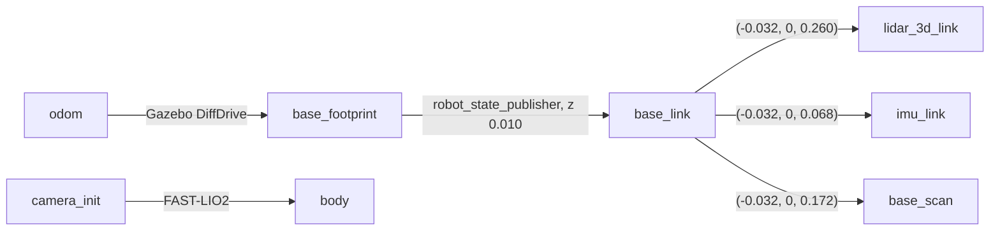

# 센서·토픽·좌표계

로봇·센서·월드는 2주차와 같습니다([week2-slam/wanjun/ROBOT_SPEC.md](../../../week2-slam/wanjun/ROBOT_SPEC.md)). 3주차에는 Nav2를 띄우지 않고, FAST-LIO2 입력용 점군 `/points_fastlio`와 시뮬레이터 정답 위치 `/ground_truth/odom`이 추가되었습니다. 아래 수치는 운영자 PC(WSL2 Ubuntu 24.04, ROS 2 Jazzy, Gazebo Sim 8)에서 확인한 값입니다.

## 1. 센서

| 센서 | 토픽 | 프레임 | 주기 | 주요 설정 |
| --- | --- | --- | --- | --- |
| 16채널 3D LiDAR | `/points` | `lidar_3d_link` | 10 Hz | 수평 720 × 수직 16, 수직 −15°~+15°, 0.10–20 m, 거리 잡음 σ 0.01 m |
| IMU | `/imu` | `imu_link` | 200 Hz | 각속도 잡음 σ 0.0002 rad/s, 가속도 잡음 σ 0.017 m/s², 자기장 없음 |
| 2D LiDAR | `/scan` | `base_scan` | 5 Hz | 360개, 0.12–3.5 m (이번 과제에서는 참고용) |
| 바퀴 odometry | `/odom` | `odom` → `base_footprint` | 30 Hz | Gazebo DiffDrive, 바퀴 간격 0.16 m, 반지름 0.033 m |
| 정답 위치 (시뮬레이터 전용) | `/ground_truth/odom` | `world` → `base_footprint` | 50 Hz | Gazebo OdometryPublisher, 3D |

- `/points`는 높이 16 × 너비 720 = 11,520점이며 필드는 `x, y, z, intensity`(float32)와 `ring`(uint16, 0–15)입니다. **점별 측정 시각 필드는 없습니다.** 측정이 없는 광선은 무한대 좌표로 들어옵니다.
- `/points_fastlio`는 무한대·0.10 m 미만 점을 뺀 같은 형식의 점군으로, 이 월드에서는 한 스캔에 약 11,170점입니다. 헤더(시각, `lidar_3d_link`)는 그대로입니다.
- 정지한 IMU의 선형가속도 z는 약 +9.79 m/s²입니다(중력 반력). 로봇이 앞뒤로 약 0.3° 기울어 서 있어 x 성분이 약 0.06 m/s² 나옵니다.
- `/ground_truth/odom`은 시뮬레이터만 아는 실제 위치입니다. 실제 로봇에는 없으므로 **추정 입력으로 쓰지 않고** 비교에만 사용합니다. `world` 원점은 지도 원점과 같고, 로봇은 `(-2.0, -0.5)`에서 +x를 보고 생성됩니다.

## 2. 토픽과 QoS

| 토픽 | 타입 | 발행 | 구독 |
| --- | --- | --- | --- |
| `/clock` | `rosgraph_msgs/msg/Clock` | 브리지 (1 kHz) | 모든 노드 (`use_sim_time`) |
| `/points` | `sensor_msgs/msg/PointCloud2` | 브리지, RELIABLE | `points_to_fastlio` (BEST_EFFORT) |
| `/points_fastlio` | `sensor_msgs/msg/PointCloud2` | `points_to_fastlio`, RELIABLE | FAST-LIO2 (BEST_EFFORT), RViz |
| `/imu` | `sensor_msgs/msg/Imu` | 브리지, RELIABLE | FAST-LIO2 (RELIABLE) |
| `/odom` | `nav_msgs/msg/Odometry` | 브리지 | 비교·RViz |
| `/ground_truth/odom` | `nav_msgs/msg/Odometry` | 브리지 | 비교 |
| `/cmd_vel` | `geometry_msgs/msg/Twist` | teleop | 브리지 → Gazebo |
| `/tf`, `/tf_static` | `tf2_msgs/msg/TFMessage` | 브리지(`odom→base_footprint`), `robot_state_publisher`, FAST-LIO2 | RViz 등 |

RELIABLE 발행자는 RELIABLE·BEST_EFFORT 구독자 모두와 연결됩니다. 반대로 BEST_EFFORT 발행자에는 RELIABLE 구독자가 연결되지 않습니다. FAST-LIO2의 IMU 구독은 RELIABLE이므로 `/imu`를 다른 노드로 다시 발행할 때는 RELIABLE로 발행해야 합니다.

## 3. 좌표계(TF)



- 시뮬레이션만 실행하면 `odom` 트리 하나가 있고, FAST-LIO2를 실행하면 **연결되지 않은 두 번째 트리** `camera_init → body`가 생깁니다.
- `body`는 FAST-LIO2가 추정한 `imu_link`입니다. `camera_init`은 FAST-LIO2가 시작한 순간의 `imu_link` 위치·자세입니다.
- 두 트리를 RViz 한 화면에서 비교하려면 `odom → camera_init` 정적 변환을 추가합니다. 로봇이 `odom` 원점에 서 있을 때 FAST-LIO2를 시작했다면 그 값은 `base_footprint`에서 본 `imu_link` 위치 `(-0.032, 0, 0.078)`입니다(0.068 + 0.010). [예시 답안](../../Solution-HJ1/launch/fast_lio_rviz.launch.py)이 이 방법을 사용합니다.
- `body`를 `base_link`의 부모로 연결하면 안 됩니다. `base_link`는 이미 `base_footprint`의 자식이고, TF는 프레임마다 부모가 하나여야 합니다.
- RViz의 Fixed Frame은 시뮬레이션만 볼 때 `odom`, FAST-LIO2 결과만 볼 때 `camera_init`을 사용합니다. Nav2를 실행하지 않으므로 `map` 프레임은 없습니다.

## 4. 시간

- 모든 노드는 `use_sim_time:=true`로 Gazebo `/clock`을 따릅니다. 센서 메시지의 `header.stamp`도 시뮬레이션 시각입니다.
- 물리 시뮬레이션 간격은 1 ms라 200 Hz IMU 주기(5 ms)를 정확히 표현합니다.
- Gazebo 3D LiDAR는 한 스캔 전체를 한 순간에 렌더링하므로 모든 점의 측정 시각은 `header.stamp`입니다. FAST-LIO2 설정의 `lidar_type: 5`가 이 가정을 사용합니다([fastlio2.md §5](fastlio2.md#5-시간-처리와-lidar_type-5)).
- 시뮬레이션을 다시 시작하면 시각이 0으로 돌아갑니다. FAST-LIO2는 시각이 거꾸로 가면 `lidar loop back, clear buffer`를 출력하므로 시뮬레이션을 재시작할 때 FAST-LIO2도 다시 시작합니다.

## 5. 점검 명령

시뮬레이션을 켠 상태에서 별도 터미널로 실행합니다.

```bash
cd week3-slam/preparation
source scripts/env.sh
ros2 topic hz /points_fastlio                 # 약 10 Hz
ros2 topic hz /imu                            # 약 200 Hz
ros2 topic echo /points --once --field fields --qos-reliability best_effort
ros2 topic echo /points_fastlio --once --field width     # 약 11,000
ros2 topic echo /imu --once --field linear_acceleration  # 정지 시 z ≈ 9.8
ros2 topic info -v /imu | grep -E "Reliability|Node name"
ros2 run tf2_ros tf2_echo base_link lidar_3d_link       # (-0.032, 0, 0.260)
ros2 run tf2_ros tf2_echo base_link imu_link            # (-0.032, 0, 0.068)
# FAST-LIO2 실행 후
ros2 topic hz /Odometry                       # 약 10 Hz
ros2 run tf2_ros tf2_echo camera_init body
```

`echo`, `hz`, `tf2_echo`는 계속 출력하므로 확인 후 `Ctrl+C`로 끝냅니다.
